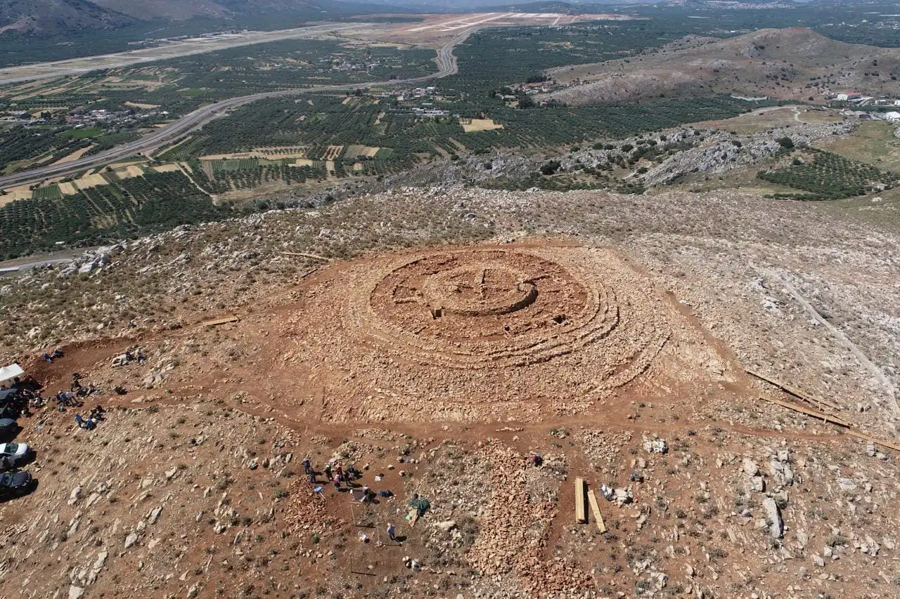

# Linear A Script

<a href="https://github.com/planetLive/LinearA/" style="right:0;position:absolute;z-index:1">GitHub</a>

## The Phaistos Disc - Deciphered!

We've combined three breakthroughs to unravel an ancient Minoan [story of sailing and love](disc):

The resulting seasonal story - from the FOUR sides of the disc - is astounding! &nbsp;Each side is read in TWO directions, starting with summer (side A, clockwise, then flip to B, then side A again counter-clockwise). The practice of inverting phrases is called kaibun in Japanese - it's common and easy since characters represent vowel sounds.  The Japanese and Minoan spoken languages are similar to Indus Valley, Sri Lanka and Korea which were likely all participants in the mirror and drum trading network - which likely has origins in Africa.

Cracking the Linear A seasons of the disc was made possible by:
1. The vocal values of Linear B applied to Linear A by [Gareth Owens](https://greekcitytimes.com/2024/02/09/phaistos-disc-mystery/).
2. The translation of the vocal values by Japanese language speaker [Hiro Kuroda](hiro/).
3. The historic context of [mirror and drum communication](https://dreamstudio.com/seasons/world-travels/) across the Minoan white-hull trade network by [Loren Heyns](https://dreamstudio.com/research).

### The story from the disc unfolds...

  

**In the summer**, a young crew member travels to Athens, the homeland of his father, where he meets a young girl. The voyage was aided by communication (punting) with mirror-axes and drums between multiple senders. At night, sunlight signaling changes to drums. To confirm transmissions, common phrases from the Phaistos Disc are flipped as kaibuns, so they don't seem like meer echoes from cave walls.

In the darkness, the voyage is one of deep soul searching and ancestrial communication. For Aegean sailers, the sun sets in the northwest in the cave of Hades and the story of their uncertain fate weaves through the disc's 4-side solar-lunar seasonal hymnals.

On first sight, the young couple knew they would have a future together. The family in Athens grants the young man a ship with the understanding that he will return with trade goods from Crete and Egypt.  

**In the fall** as he travels south, the Big Dipper in the north represents the young woman left behind who is due to become a mother. The young captain joins the Crete white-hull network with his small dragon boat, commiting to a tax rather than risk the high penalty if he were to return through the waters in an unaffiliate boat loaded with goods.

We learn that in the Minoan trade network, a handshack for a trade agreement is often conducted at a distance using mirrors.

[Read the full translation!](disc)

## Global Mirror Network

Exploring the use of mirrors, drums, fire signals, and bird couriers for trade logistics prior to 1,400 BCE can improve the accuracy of translations and understanding of early art. <!--The role of line-of-sight communication in the location of megalythic structures, hilltop temples, and the construction of straight roads through tree canopy  visual signaling.-->

<!--complimented by audio and high areal light displays (fireworks and reflection off clouds, tops of ziggurats and mountain peaks)-->

We've expanded on the LinearA translations of [Hiro Kuroda](hiro/) by adding related information on the Minoan mirror network that fostered trade in the Aegean Sea between Greece, Crete, Egypt and [The Land of Punt](https://dreamstudio.com/seasons/summer/punt/).

Linear A (1) evolved to be concise, using sounds from the start of words, and (2) efficient with minimum strokes like its use in Indus Valley script to its offspring Japanese hiragana. Translations using Japanese seem to reveal that the Phaistos Disc contains a mirror signal chant about the seasonal trade migration to Athens where families bound across long distances by marriages used mirrors to "punt light" between islands where Minoan ships designated with white hulls were pre-certified by the trade network and traveled free of tarrifs.

&ndash; Loren Heyns (drawing upon the [Minoan&nbsp;Mirror&nbsp;Web](https://www.minoanatlantis.com/Minoan_Mirror_Web.php))

The Linear A repo is part of the [Cleo story at DreamStudio.com/Seasons](http://dreamstudio.com/seasons/) 

## Content

[Linear A Translations](hiro/) - Hiro Kuroda (with images added)

The third image above is a dual-mirror for sending Morse Code which was inspired by a theodolite survey crew in India who were returning messages to other crew members.

The box-mirror above was found in Israel in 2023 in the tomb of a woman traveling with Alexander's generals.

[Source: Sheppard Baird](https://www.minoanatlantis.com/Minoan_Mirror_Web.php) - Also see <a href="/LinearA/img/Minoan_Peak_Sanctuaries_Proto-Palatial_Connections.jpg">Crete closeup map</a>

[Circular Labyrinthine](https://www.labrujulaverde.com/en/2024/06/extraordinary-circular-labyrinthine-structure-from-the-minoan-era-formed-by-8-stone-rings-discovered-in-crete/) at Papoura Hill, at an altitude of 494 meters.
[Located north of Liliano (#16)](https://www.google.com/maps/dir/Liliano,+Greece/35.219917,25.322472/@35.2043604,25.0021873,106550m/data=!3m1!1e3!4m9!4m8!1m5!1m1!1s0x149a8af570dd7747:0x35a0f9c516006f59!2m2!1d25.3304831!2d35.1844792!1m0!3e2?hl=en&entry=ttu) on the north side of the airport. 
Perhaps Papoura Hill has line-of-sight to Phaistos?

## Dive in, but take your mirrors!

The shape of the Minoan shield is perfect for carrying the two sides of your mirror box - for communicating from boat decks to hill temples. With the strings attached to your metal plates, you have a scale for weighing shipping goods (grains and spices) in the market. When attaced to your front metal plate, the shield floats, so you won't loose your paperwork and cipher mirror-ax.

The convex shape of the shield would also allow a drum beat to be narrow-cast in a single direction for greater security during troop movement.

From the side of a small polished ax-mirror, an imprinted ciper helps young mirror operators learn to translate the signals that arrive like drum beats - and sometimes are drum beats or even fires burning is signal towers, lighthouses and the tops of pyramids. &nbsp;Large polished labrys could have been pivoted by adults to send signals greater distances - sometimes over 70 km on a clear day between hilltop peaks! (<a href="https://www.quora.com/Could-ancient-civilizations-have-used-mirrors-to-communicate-long-distances">Nick Deakin</a>)  

 

Sometimes the fire signals may have been fueled by naturally seeping hydrogen and methane, like the hydrogen wind that rushes out of a dry well in a Mali village. In 2023, the Mali village converted from buring the hydrogen for power to using a clean fuelcell to power their homes!

<a href="hiro/" class="btn btn-primary">Connections with Japanese</a> <a href="https://dreamstudio.com/seasons/world-travels/" class="btn btn-primary">Phaistos Disc: World Travels</a>