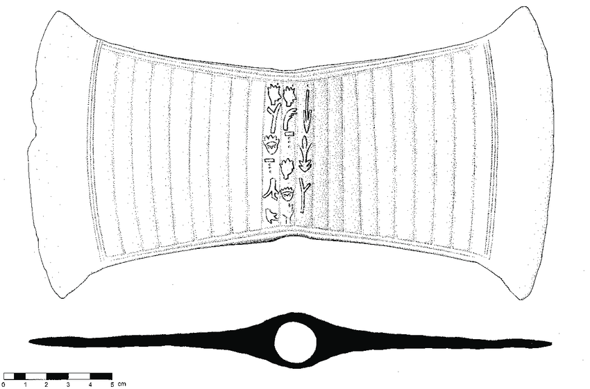
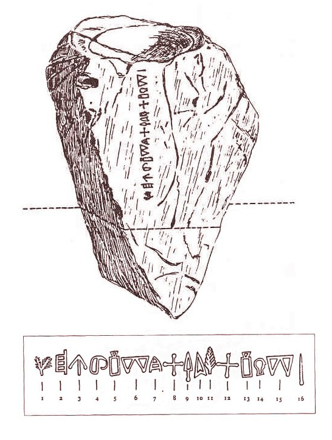

[Introduction](../)

Recent June 2024 publication by [Mizuhiro Kuroda](https://independent.academia.edu/HiroKuroda?swp=tc-au-48923197) on [Indus Script](https://www.academia.edu/48923197/Indus_Script?auto=download&email_work_card=download-paper)

<!--
Now that the sound of Linear A from the Phaistos Disc has been decoded, has anyone created a translation using Swahili, Zulu, Xhosa, and/or Yoruba? Are you familiar with the translation by Hiro (Mizuhiro) Kuroda using Japanese? If so, can you make comparisons between the two translations?
-->

# Ancient Minoans - Japanese Language Origins

[Original paper](https://www.academia.edu/39029658/Linear_A_and_Japanese_Language_Phaistos_Disk_is_Decoded_) by Hiro Kuroda with updates by [Loren Heyns](https://dreamstudio.com/earth/) to include Minoan mirror communication network elements. The mirror network operators managed seasonal trade between The Land of Punt, Egypt, Crete and Greece (Athens, Mycenae, Tiryns and Thebes). Read Loren's addition of seasonal trade in [The Seasons of the Disc](../disc) and explore the [Global Mirror Network](https://dreamstudio.com/seasons/mirror-network/)

## Linear A is Nihongo

[By Hiro Kuroda](https://independent.academia.edu/HiroKuroda), Sept 2000 - [Source](https://ncode.syosetu.com/n8792gc/1/)

The following is an attempt to highlight the remarkable similarities that can be found in the language of the ancient Minoans of Crete as recorded in the Linear A script and the Japanese language, in a suggestion to researchers that Linear A may not necessarily be an Indo-European language found in Europe and the Mediterranean area, and that therefore they should try to expand the scope of candidates when trying to find the language underlying Linear A.

In the opinion of this writer, the language underlying Linear A must be an old form of Japanese. This may sound far-fetched but is readily verifiable and in line with the views of Gretchen Leonhardt. It can be demonstrated that Linear A symbols were invented by people who spoke a language that shared basic words with Japanese, and the meaning of Linear A texts can be interpreted in Japanese to a high degree of “refinement” as to recognize a play on words, including puns and hidden meanings.

At the same time however, we cannot rule out the possibility that traces of the Minoan language may be found in countries other than Japan as a result of their dispersal, dissemination and migration from the Eastern Mediterranean to different regions in the world.

Therefore, there could be other candidates for the language underlying Linear A or descended from the ancient Minoan tongue, and these claims need not be mutually exclusive. For this writer, the Japanese language is the key that fits best in terms of unlocking the secrets of Linear A, but other keys may also do a good job. What is important is that the Linear A text interpretations should all agree in the end and, in that case, all the strong candidates should be languages that are related.

Why people (except Leonhardt) never thought of Japanese as a possible candidate is well understandable. Scholars who form the mainstream of researchers in Linear A may be versed in the classic languages of Europe, such as Greek and Latin, or of the Middle East, but perhaps not in the Japanese language, so they might not have recognized striking similarities in Japanese. Simply put, the strongest point for this writer is that he happens to be a native speaker of the Japanese language.

Moreover, the geographic distance from Crete to Japan in ancient times must have appeared as a formidable barrier between languages in the Mediterranean region and the Far East. However, we must allow for the possibility of a process of Minoan migration that may have taken years and decades, if not centuries.

It is only because of the internet and 21st century IT that photos and videos of Linear A texts, sites in Crete and other islands in the Aegean, not to speak of the work of researchers around the world, have become easily accessible without frequent travel. As a result, linguistic analysis and mutual collaboration is now unimaginably efficient, allowing for much more flexible thinking and a wider range of choices and possibilities. 

Cf. Gretchen E. Leonhardt. 2018. Fifteen, Linear -Script Signs with Correspondences in Japanese Kanji and Hiragana (Academia. edu)

## CONTENTS

### I. Overview

Introduction
Geographic Names in the Aegean Sea
Similar Cultures

### II. Written Language

Linear A Symbols Represent Japanese Words
12 Signs of the Oriental Zodiac
Other Resemblances

### III. Text Interpretations in Japanese

1. Balanced Ledger Tablets
2. The Libation Formulas
3. Silver Pin from Mavro Spelio
4. Gold Ring of Mavro Spelio
5. Bronze Bowl
6. Gold Pin
7.	Clay Tablet Fragments
8.	Phaistos Disc
9.	<a href="#code">Arkalochori Axe</a>
10. Malia Stone Block

### IV. Conclusion

1. Migration
2.	Comparative Mythology
3.	Minoan Symbols in Japan
4.	Geographic Names in Japan
5.	Early Forms of Writing in Japan
6.	DNA Analysis
7.	Overview

## Introduction

**(1)** The Minoans gave birth to a bronze age civilization on the island of Crete in the Aegean circa 3000 BCE that centered around the palace of Knossos and reached their peak in the 2nd millennium BCE.

In the Pre-palatial Period (2600-1900 BCE), they built their wealth and enjoyed prosperity through trade in the Mediterranean region with partners such as Egypt, importing copper, tin and gold.  

Around 1900 BCE, new cities and palaces were built in Knossos, Phaistos, Malia and Zakros, marking the beginning of the Proto-palatial Period (1900-1700 BCE), during which the Minoans expanded their sphere of influence to colonize islands such as Thera, Milos and Kythera.

In and around 1700 BCE, there was a great disturbance on Crete, thought to have been an earthquake or war caused by outside invaders. The 4 palaces were destroyed and had to be rebuilt, and this marked the start of the Neo-palatial Period (1700- 1400 BCE).

Then, circa 1628 BCE, the Thera (Santorini) volcanic eruption took place, causing tsunamis to sweep over Crete, wreaking havoc and destruction. 

Circa 1450 BCE, there was a transition of writing systems from Linear A (yet undeciphered) to Linear B (representing an old form of Greek), and this was evidently caused by the influx of Mycenaeans from the Greek mainland who became the new rulers in Crete. Crete flourished and its golden age continued until about 1375 BCE, when Knossos Palace was apparently destroyed by an earthquake.

This civilization is thought to have finally disappeared during the Bronze Age collapse, circa 1177 BCE, together with other civilizations such as the Mycenaeans and the Hittites (Nessites).
<!--
Some theorize that the lost civilization of Atlantis, described by the Greek philosopher Plato, must have been none other than the Minoan civilization.
-->
**(2)** Excavations on Crete have revealed 2 ancient languages, Linear A and Linear B, that share many symbols or letters. Linear B was deciphered and identified as ancient Greek in between 1951 and 1953, but Linear A, probably its immediate ancestor, has yet to be decoded and understood, i.e. the underlying language is unknown. It is believed that Linear A came into use around 1800 BCE.

Experts believe they can read out Linear A by applying the same phonetic rules as in Linear B, so that Linear A may be read out loud to reproduce the language as it must have been spoken by the Minoans.

Nevertheless, Linear A has long frustrated those who have tried to identify and understand it as being related to any of the known languages in Europe or the Mediterranean. 

**(3)** Consequently, researchers are beginning to entertain the idea that, if there are any existing languages descended from Linear A, they should be found outside the realm of the Indo-European languages.

In that case, the scope of research should be expanded to cover languages in areas geographically distant from Crete and the Mediterranean, to see if any exotic language outside the Indo-European domain may possibly fit its description. 

**(4)** This may include Japanese, as it is a language based on syllables, just like Linear A, and because there seem to be striking similarities in the way the 2 languages sound, when spoken or read out loud.

Japanese seems to be a language in a category of its own, together with Korean, which closely resembles Japanese, so that the 2 languages form an isolated language group in Northeast Asia, and researchers are curious to know how they came into being. 

**(5)** In Japan, experts have pointed out that the Japanese language seems to be related to languages such as Mongol and Turkish, judging from word order and, as a group, these may be referred to as the Altaic languages. They also consider another linkage, i.e. with the Polynesian languages, and that the Japanese language must have developed under these two important sources of influence.

In this context, the contention to be expounded here, that the language underlying Linear A is Japanese, or that the Minoan language was one of the most important ancestral languages of Japanese, must pertain to the Altaic influence from the Eurasian continent.

 

[Nick Deakin - Minoan Telecomm](https://www.quora.com/Could-ancient-civilizations-have-used-mirrors-to-communicate-long-distances)

## Geographic Names in the Aegean Sea

If a Japanese speaker takes the time to carefully peruse through a map of Crete and of the Aegean Sea with focus on the Cycladic Islands, there will be many geographic names, including islands, that sound as though they might have come right out of the Japanese language so as to arouse curiosity, such as follows:

(1) ZAKROS This is the name of a mountain range on Crete, and it means pomegranate in Japanese.

(2) MATALA This is an ancient port, close to Phaistos. It is known for the man-made caves dotting the cliffs along the shore that were used as dwellings by the ancients. The name evokes the Japanese word MADALA, that may mean dotted, or suggest crotch (MATA) of the island Crete. There is a strange deity in the form of a bull who appears in the Bull Festival of Oh-Sake Shrine, close to Ho-Ryu-ji Temple in Kyoto, and whose name is MATALA.

(3) CHANIA This city is located on the northwestern coast, just before a large promontory or headland, and is the 2nd largest city in Crete. The whole island of Crete may be described as a caricature of a man standing with his feet on the eastern end, head on the western end, and head turned northwards, toward the Greek mainland. Then Chania will be located at the base of the nose, and nose in Japanese happens to be, HA-NA. 

(4) SEITAN LIMANIA Beach

This is a beautiful, secluded beach rather close to Chania, known for its turquoise blue waters. It is apparently called Satan’s Harbors in English, but SEITAN means “clear blue” in Japanese, and the color of the waters there, as recognizable in photos and you-tube programs, may easily convince Japanese speakers that the name must have Japanese roots.

(5) MALIA To continue with the above metaphor on Crete island, this city on the northern coast is located at the base of the male genitalia, MALA, in more vulgar Japanese terminology. 

(6) KNOSSOS    This may correspond to KU-NI-SU(くにす、国巣or国津。The country’s nest or harbor) in Linear A.
The Japanese word “kuni” is said to have appeared in the Yayoi era to denote a unit group of hamlets, and eventually developed into what may correspond to the notion of a country or kingdom, whose areas were then limited to cover regions in Japan, such as Izumo. Thus, the resemblance with the first syllable in the word Knossos.

(7) KEFTIU     The Minoans were apparently called the Kef-tiu, according to records kept in ancient Egypt. When this word is transcribed into Japanese of an older style, “kef” may be pronounced as “kyo,” and so Kef-tiu may be the original form of the city’s name, Kyoto.

(8) NAXOS    This is the island in the Aegean on which Theseus is supposed to have abandoned Ariadne, despite his original intention of taking her back to Athens. He was compelled to do this at the behest of the deity Dionysus who had fallen in love with her. In Japanese, the name may be translated as Crying Island or Wailing Island, and this may very well describe the scene on the island after Theseus had left for Athens, leaving Ariadne behind.

(9) KEA, KYTHERA, MILOS, THERA

These are islands in the Aegean where Linear A inscriptions have been found, and whose names sound very Japanese.

THERA must be the older name for the island of Santorini, known for the cataclysmic, volcanic earthquake in ancient times thought to have devastated Crete with ensuing tsunamis which led to the decline and disappearance of the Minoan people. In Japanese, it means temple, or a place of worship.  

KYTHERA is a Japanese surname, and Japanese people will associate MILOS with the word milo, that means “take a look.”   

(10) MIKONOS  This island name evokes the word MIKOTO in Japanese, that means the words of the sacred one, and which is often attached to the end of names of deities.

(11) ALASHIYA   This was the name of Cyprus in the Bronze Age, known for copper production. The ancient language of Cyprus was written in the Cypro-Minoan syllabary that was, similar to Linear A. In Japanese, ALASHI means storm, and ALASHIYA, storm shelter.

There is an interesting parallel in the Story of Wenamun from a literary Egyptian text in papyrus, circa 1000 BCE. Wenamun, a priest of Egypt, is sent to Byblos for business and, blown off course on his return sea journey to Egypt, finds shelter on Alashiya.

## Similar Cultures

Furthermore, if one takes time to compare the characteristics of the Minoans and the Japanese people, one will find many similarities, perhaps owing to common factors in the living environment, as follows:

(1) Island people living close to volcanoes and on land prone to earthquakes and tsunamis. Latitude 35 degrees north, running across southern Crete, crosses just north of Hiroshima. Temperate climate and plenty of water, with mountainous terrain rich in verdure, with diverse flora and fauna.

(2) Seafaring nations with attachment to fish and other sea creatures that were important in their diet, and which achieved economic prosperity through trade with other countries in the Mediterranean region.

(3) Worship of a Goddess.

(4) No city walls. The palace of Knossos has been described as a labyrinth because the pathways and chambers are designed like a maze that would confuse visitors; Japanese castles typically use a maze-like construction to confuse strangers and enemies.

(5) Possibly based on egalitarian values.

(6) Minoan Art

Urns bearing horizontal decorations marked with ropes, somewhat resembling Jo-mon pottery from ancient times in Japan.

Chrysanthemum Design

In the palace of Knossos, there is a room with frescoes of a school of dolphins on the upper walls, below which are the entrances decorated on 3 sides with repeated use of a symbolic flower design, resembling a chrysanthemum with 12 petals. This has an uncanny resemblance to the emblem of the Imperial family of Japan, which is a chrysanthemum with 16 petals.

Brightly colored frescoes depict people and animals that may remind observers of traditional Japanese paintings and wood-block printings, as well as present- day manga and anime.

Young females with elaborate facial make-up, including white foundation and lipstick, and attire somehow resembling kimonos in length, that may recall the Maiko ladies, i.e. young apprentice geishas in Kyoto.

(7) Lovers of Sport

Minoans are known for the strange custom of bull-leaping; Japanese Olympic gymnasts are a source of national pride. Scenes of boxing have also been depicted in Minoan frescoes.

(8) Dancing (Bon-Odori)

 Women dancing in unison, all with both hands high in the air, in synchronized fashion, seems to be a favorite theme in sculpture and for adorning ornaments, notably the golden signet ring from Isopata, Crete (Heraklion Museum).  
Anyone who has stayed in Japan over a summer to watch the Bon-Odori festival will appreciate striking similarities with Bon-Odori dancing that mimic the same movements and gestures.

(9) Obsession with Hatti, or the Number 8

The Minoans seem to have an affinity with bees, as they kept them for honey and often used them in designing ornaments. As discussed later, the words KU-RO and KI-RO may be rooted in the abdomen of bees, striped in black and yellow. 
Some scholars point to the possibility that Minoans may be descended from the ancient Hatti people in Anatolia and thus the obsession with bees, as they are called HA-TCHI in Japanese.

This word also denotes the number 8, perhaps because bees, with their head, tail and 6 legs, point in 8 directions. If Minoans gave the word HA-TCHI the same meaning, their obsession may extend to the number 8, as in their “figure of 8” shields.

The Japanese are known for an obsession with the number 8, written as 八 and read either as Hatchi or Ya, as in Yasaka Shrine in Kyoto and the deity Hatchi-Man, worshipped in many shrines across Japan.

This may come from the fact that people in the Harappan civilization, who also spoke an ancient form of Japanese, believed in a colossal entity that made the night sky revolve around the North Star, and this was the Octopus of the North. Situated beyond the North Star, this giant spaceship of an octopus encompassed the universe with its 8 legs, stretching them onto the sky as onto the bones of an umbrella, and made the universe revolve. They may also have believed that when someone dies, their soul will ascend to heaven, to become part of the Northern Octopus.

(10) Purple Dye from Snails

The Minoans are known to have extracted a purple dye from the sea snail known as murex, and a diagram of this snail appears to have become the Linear A symbol for the sound MU, where MU stands for the word Murasaki, meaning purple in Japanese. 
Because of the toil and trouble as well as the unpleasant procedure in preparing the dye in sufficient quantities for soaking garments, it became a prized commodity in the eastern Mediterranean from the bronze age to times of the Byzantine Empire, giving rise to the terms, royal purple and imperial purple.
In Japan, purple cloth fragments unearthed from Yoshinogari, a Yayoi age settlement in Kyushu, have been found to be dyed using this method. Furthermore, in 603 CE, Prince Shotoku adopted the 12 Orders of Caps, in which the highest order was represented by a cap in purple. 
Thus, purple was considered as the color of highest order in Japan, much in the way it was prized in the eastern Mediterranean. In contrast, the Chinese proffered the highest rank to yellow, a color set aside for emperors and in Korea, the corresponding color was red.

## Written Language

Reproduced below is a list of Linear A symbols as presented by Gia Kvashilava in his paper On Decipherment of the Inscriptions of Linear A in the Common Kartvelian Language : ku-ro and ki-ro (ATINER Conference Presentation Series LNG2018-0153). The numbers are according to E. Bennett. 

(By the way, we may infer that, if Gia is correct in his analysis of the language behind Linear A, Japanese and the Kartvelian languages (spoken in Georgia north of Turkey) must be related to each other.)

## Linear A Symbols Represent Japanese Words

The efforts of researchers such as Alice Kober, Michael Ventris and John Chadwick have led to the conclusion that Linear B inscriptions from excavations led by Sir Arthur Evans on Crete were in fact an archaic form of the Greek language, and so the phonetics of the Linear B symbols are now well known and established.

Linear A shares many symbols with Linear B and the latter writing system is considered as an offshoot of Linear A. This has led to the established view that Linear A symbols must represent the same sounds as the corresponding Linear B symbols; they are known to represent either a vowel or a syllable, formed by a consonant plus a vowel as in Japanese hiragana.

(1) Some of the Linear A symbols, judging from their visual effect, seem to be old prototypes of Japanese hiragana (or katakana) letters that represent the same sound. A most convincing example, with uncanny resemblance, may be the symbol for JU, pronounced YU in Japanese.

(2) We may also notice that, for many of these Linear A signs and others, the sounds point to certain short words in the Japanese language that can be visualized in the images thrown by these signs or symbols, when construed as pictograms fraught with meaning.

(3) After a careful examination of the Linear A symbols, the phonetics represented and their connotation in Japanese, we are led to discover a simple rule by which these letters were created. 

That is to say, the ancient Minoans chose a group of short words with 1 or 2 syllables, such as hand or ear; then they decided to represent each word with a simple, consistent sign. Eventually, these graphics became Linear A symbols that represent the first syllable in each of these words.

Sign for horse or U-MA ⇒ Linear A symbol for U

The inevitable conclusion is that the people who invented the Linear A script spoke the Japanese language, as illustrated below.

(\* stands for AB）

(Symbol)     (Image)                  　(Corresponding Japanese Word)
A (\*08)       Sacred cow from Egypt               Apis (Hapis)
E (\*38)       Pyramid of Egypt                    Egypto = Egypt
I (\*28)        Torch                               Hi = Fire
O (\*61)       Mother of pearl             classical Greek, οςτρεον (oyster)                       
U (\*10)        Horse’s head with long neck          Uma = Horse

AU (\*85)   Fish on a hook, head pulled out of water   Ao = Blue, Uo = Fish
DE (\*45)      Ornate building                 Den = Palace, Dekai= Big

DU (\*51)   Mammal with hump, looking left ≈ 丑　　Ushi = Cow or bull
JU (\*65)    Lily/ Cradle                    Yuri (Lily) / Yurikago (Cradle)
KA (\*77)      Circle with cross inside    Kame = Turtle, Kagami = Mirror

KI (\*67)   Minoan rhyton or conical container  ≈ き, キ    Ki = Container 
KO (\*70)        Nail pointing downwards            Koko = Right Here
KU (\*81)    Bird, wings spread ≈ く  Karasu = Crow, Kamome = seagull

MA (\*80)   Head of demon                        Mamono = Demon
ME (\*13)    Young sprout ≈ め             　     Me = Sprout 
MI (\*73)   Ear, plant bearing fruit or snake        Mimi = Ear, Mi = Fruit, 
Mi = Snake, as Zodiac sign

MU (\*23)   Person notices creature on arm ≈ む  Mushi = Insect
           Murex sea snail, source of purple dye  Murasaki = Purple

NA (\*06)   Tears falling from an eye                Namida = Tears

NE (\*24)     Mouse running through, 王　≈　子　  Nezumi  = Mouse
NI (\*30)      T or Y, with marks on each shoulder   Ni = Luggage
PO (\*11)     Side view of breast                    Oppai=Breast
(P ⇒ B  Beni = Pink.  Cf. Minoan fashion)

PU (\*29, \*50)   Bellows                            Fuigo = Bellows
QA (\*16)      Flower on stem                      Hana = Flower
QE (\*78)    Face with surprised expression          Ke ?  (interjection)
QI (\*21)    Sheep’s head ≈ 未 　       　          Hitsuji = Sheep 

RA(\*76)  　Double Z’s or S’s (Aquarius sign)       Rasen = Lines repeating,
RI(\*53)     Glance of right eye ≈ り                 Ri = Reason
RO(\*02)     Cross, oar or punt ≈ ろ                Ro = Punt

SA (\*31)     Shape of Y                       San=three, Sakana = Fish
SE (\*09)     Fork/Inverted Scorpio sign         Senaka = Backside, or
Semi = Cycada
SI (\*41)     Vertical line beneath wicket         Shi = Branches, offshoots 
SU (\*58)     Spiral, labyrinth                   Su = Nest

TA (\*59/ \*66)  Dragon/ Kite                  Tatsu = Dragon/ Tako = Kite
TE (\*04)     Palm leaf    　          　　           Te = Hand 
TI (\*37)     Woman’s breast                   Titi = Breast, for nursing
TO (\*05)     Dragonfly                        Tombo = Dragonfly
TU (\*69)     Downward arrow             Tsuchi = Earth, Tsuma = Wife

WA (\*54)     Loom, for weaving               Wata = Cotton
ZA (\*17)      Circle on altar 　                Za = Seat, Throne 
ZO (\*20)      Upwards arrow                  Zoku = Arrowhead
ZU (\*79)      Head                            Zu = Head

(4) Combined Symbols

Most of the Linear A symbols with attached numbers greater than (A501) are created out of 2 or more simple signs, in a similar way to Chinese kanji.

Oil

The symbols from（A548）to（A552）are based on a diagram of a spoon or ladle. They are all filled with a liquid of strong surface tension, so that the fluid takes on a globular appearance. It can be construed as either mercury or oil. The ladle resembles JU（\*65）and will be read as YU, meaning oil in Japanese.

A548　：　 TA-YU. The symbol on the left side,  ]　is a representation of a dragon and, taken together with the ladle on the right side, can be interpreted as mercury because, in Japanese,  Shin-sha (Dragon Sand) is the red mineral from which mercury is extracted.

A549  ：   The sign [ ] above the ladle can be read as TU (for TUI, or pair) and taken together, TU-YU means dew or broth.

A551  :    If I (\*28) on the ladle represents fire (HI), then lamp;
           otherwise, oil from fermented squid (I-KA).　

A552  :   YU-KA(GAMI). The KA（\*77）above the ladle represents  mirror, so this must be a mirror polished with mercury.

 Potter’s Wheel

The silhouette on the right side of (AB\*180）traces the left half of a vase, and it may be a signify a potter’s wheel, as the form of a vase should emerge when it is revolved 360 degrees around its perpendicular axis on the right side. Potter’s wheel in Japanese is RO-KU-RO and the radical can be read as RO-KU. Then the relevant composite symbols can be interpreted as follows:

(A599）　To the right side of RO-KU（\*180）is inscribed the sign for North Star [・]. This must point to the heavens revolving around North Star and can be read as KI-RO-KU, that means records in Japanese. 

(A602)　 To the right of RO-KU（\*180）is RO (\*02）and this should be read as RO-KU-RO, potter’s wheel. 

(A600)　 This is an elaborate form of RO-KU-RO (A602), with SA(\*31)  inscribed inside RO-KU; SA(\*31) takes the shape of Y and lets one imagine something lifted off the ground. This must be the symbol for pulley that the Minoans must have used to load and unload ships.

(A603） To the right of RO-KU（\*180）there is an A turned 90 degrees counter-clockwise with 「・」just below. The right half must show an object lifted above ground and the whole symbol must stand for pulley.

(A601） This is（A603）with SA(\*31) inside the radical RO-KU（\*180）and must also signify pulley.

Others

A512　：　　QI（\*21）＋ SI(\*41)　　⇒　　　　QI－SI（Shore）

If (A301) is read as TO,

A519  :    I(\*28)+TO(A301)       　⇒ 　　　I-TO （Thread）
A520  :    TO(A301)+ I(\*28)        ⇒　　　 TO-I  （Gutter）

A526　：　　KA（\*77）above E（\*38） ⇒　　　　KA-E　（Sea、World）
KA stands for mirror and E, pyramid; this must be the mirror to the north of Egypt.

A532  ：　　SI（\*41）＋ TA（\*66）　⇒　　　　SI-TA（Below）
A535　：　　KU（\*81）＋ WA（\*54）　⇒　　　　KU-WA（Mulberry）   
A547　：　　TA（\*59）+　TU（\*69）　⇒　　　　TA-TU　（Dragon）
A553　：　　TO（\*301）＋ MI（\*73）　⇒　　　 TO-MI（Wealth）
A554　：　　A（\*08） + KA（\*77）　　⇒　　  A-KA（Red）/ HA-KA （Tomb） 

Loren Heyns addes: Could this be a mirror-pully that automatically pivots a mirror toward a fixed receiver as the sun moved across the sky daily?  Sand gradually sifting from a vase could gradually move the pully to turn the mirror.

2.  12 Signs of the Oriental Zodiac

The 12 animals of the Oriental or Chinese zodiac are represented by a special set of symbols that differ from ordinary kanji in Japan or China, and the tradition is considered very ancient, with roots other than China.

Upon scrutiny, if the 12 symbols are examined in their original form, as oracle bone script from the Shang dynasty, they seem to be rooted in Linear A, with 3 exceptions drawn from the Cypriot syllabary, a relative of Linear A;  Among these, Tiger and Dragon were not to be found in Crete and, as for Dog, the noun happens to begin with I, the same as for Wild Boar, so they must have found it convenient to borrow symbols from the Cypriot syllabary.

(Symbol)  (Sound Value)  (Animal)   　(Related Symbol)
子　　　 　NE      　Mouse   
〇Early oracle bone script:   the symbol NA/NE from Indus script.
〇Late oracle bone script:    Northern Octopus. 
〇Post-Warring States Period: Sleeping baby, for NENNE (sleep), 
pointing to North Star, known to be immobile.     

丑     　  USHI      Ox           DU（\*51）      
寅　　　   TORA      Tiger   　   Cypriot syllabary TO+RA　 
卯　　　   U　　    　Rabbit　　 　U（\*10）,a pair in combination.
辰　　　   TATSU     Dragon 　   Cypriot syllabary TA+ TU　

巳　　   　MI　  　 　 Snake　　  
〇Early oracle bone script: Sleeping baby, for NENNE. 
North star used to be in this position.
〇Post-Warring States Period： Snake.
午　　　   UMA        Horse       Galloping horse, seen from above.   
未　　　   HITSUJI    Sheep       QI（\*21F）
申　　   　SARU       Monkey 　  SA（\*31）+ RU（\*26）

酉　　   　TORI　    　Bird

〇 The symbol in oracle bone script resembles a goblet, or wine vessel. TORI could be Minoan for “ti-ri-po-de,” the Mycenaean (Linear B) word for tripod. If so, the symbol can be construed as an upside-down triangle, to show the base of the tripod, plus a flat saucer that springs out from its center, to depict the tripod in profile.

〇 From Linear A, TO（\*05）+RI（\*53）are written together, then the resulting form is filled out, to achieve symmetry.

戌　　     INU         Dog　    Archer, to depict the word INU
 　　　　　(shoot an arrow) / Cypriot syllabary I+NU  

亥         I　　　    Wild Boar 　I(\*28), a combined pair, one upside down  

3.  Other Resemblances

 No distinction between the sounds L and R.

 Consonant Z and Dakuten

 In Japanese, the syllables formed with Z + vowels, are represented by hiragana that show the heavy Z sound with a “dakuten” or 2 diagonal slashes, akin to “close quotation marks,” that appear on the top right side of each letter, as
ざ　じ　ず　ぜ　ぞ.
 In Linear A, there is a similar presentation in the symbols for Zu and Ze, as they both have 3 dots aligned vertically on the right side. Zo has an arrow with the tip pointing upward. So the 3 dots and the arrow tip may have all changed into “dakuten” as they were transformed into hiragana.

 Consonant W

 In modern Japanese, the syllabics formed with W + vowels have all but disappeared from hiragana and katakana through disuse, except for Wa and Wo, because people no longer distinguish the sounds Wi, Wu, We, from the vowels I, U, E.

 There is a similar situation in Linear A, as only the 2 symbols, Wa and Wi, are known to date. Their symbols show a marked similarity with the katakana symbols, ワ (Wa)　and ヰ (Wi). This latter Wi symbol is an older form that has all but disappeared from written Japanese.

Text Interpretations in Japanese
1．Balanced Ledger Tablets

(1) Linear A is known for clay tablets that present balanced ledgers or lists of what are presumably nouns followed by numerical values. The nouns may indicate the respective sources of origin including the names of suppliers pertaining to farms and workshops.
 Many of these tablets have been found in Haghia Triada, hence HT preceding the designated numbers. GORILA with page numbers refers to the online resources provided by the Ecole francaise d’Athenes as compiled by Olivier and Godart.

(2) KU-RO and KI-RO

 We will now turn our attention to the words KU-RO and KI-RO that often appear in these lists. They are often cited as key words in finding the language underlying Linear A.

(a) At the bottom of each list, the total amount is registered, as can be ascertained by simple addition, and this sum is very often preceded by the word KU-RO. For this reason, notwithstanding the difficulty of deciphering Linear A, it has been known from the times of Chadwick that KU-RO must mean, total. KU-RO means “black” in Japanese and so the original meaning of KU-RO in the Minoan tongue may also have been “black.” Here are some possible explanations.
〇Black happens to be the color of the crow or blackbird (ΚΟΨΙΧΟΣin ancient Greek), known to have the habit of gathering things that look shiny, and the Minoans may have decided to use KU-RO to express the idea of a gathered sum. Alternatively, KU-RO could have been the impressionist color of a large flock of birds flying in close formation.
〇Black denotes the color of ink that is spewed out by squid, cuttlefish and octopi. This was used to practice writing, on slabs of light- colored pieces of rock, etc., and eventually took on the meaning of, FOR THE RECORD.
〇While the columns in the Palace of Knossos were painted red, the capitals were black, as if to imitate the hair color of the Minoans. Thus, KU-RO may have come to denote height, and in turn, tot al value. In fact, the English word CROWN, meaning both head ornament and unit of money, may possibly be rooted in KU-RO.  

Sometimes, underneath KU-RO and followed by a number, there appears the term PO-TO-KU-RO (HT 131) that seems to denote, grand total. If pronounced as PON-TO-KU-RO, this translates into HON-TO-KU-RO in modern Japanese, to be construed as, KU-RO, IN REALITY.  Furthermore, since the Greek word PANTA means, ALL, the word PO-TO-KU-RO may be a hybrid invention pointing to, grand total.　

(b) KI-RO is another term that often appears at the bottom of a list, e.g. HT 30. Gia Kvashilava interprets this to mean subtraction or lessening. He in turn draws from translations of KI-RO by other researchers including Younger, as “owed,” “deficit” or “balance.” As a matter of fact, KI-RO means “yellow” in Japanese, and often signifies “caution.” 
The Minoans may have attached the meaning of “deficit” to the word KI-RO (meaning yellow) because, while they kept bees for their honey, they observed their abdominal parts, striped in black and yellow, and thought the yellow stripes gave the impression of “emptiness.”
A word that sounds similar but with a different meaning is the verb KI-RU meaning “cut” or “cut off” in Japanese. The past participle type adjectives appear in Linear A as follows:

(HT 85) (GORILA I : 130-133))
KI-RE-TA       :  きれた、切れた (Cut in pieces, truncated)
(HT 114) (GORILA I : 186-187 )
KI-RI-TA       :  きりた、切った (Cut in pieces, truncated)

(3) Examples

（HT 13, GORILA I, 26-27）

（Heading）　KA-U-DE-TA 　(Here are the results/Purchase results)
(Items)
RE-ZA 51/2;　TE-TU 56;　TE-KI 271/2;　KU-DO-NI 18;　DA-SI-\*118 19;　I-DU-NE-SI 5; KU-RO 1301/█(2@)
Each of these may represent a buyer, seller, or commodity. TE-TU may mean iron; KU-RO, crocus=saffron.
(HT 87, GORILA I, 136)

(Heading)　QI-TU-NE MA-KA-RI-TE （With the Visitation of the Fox）

（Items） Each one is followed by the numeral 1.

PI-TA-KE-SI；JA-RE-MI; DI-KI-SE；QE-SU-PU; KU-RU-KU; A-RA-？-A-TU

From ancient Mesopotamia, there is a manual on astrology written in cuneiform on clay tablets, known as the Enuma-Anu-Enlil. In number 50 of this series, asterisms and constellations are linked with earthly events, to the effect that the appearance of the “crow” is associated with stability in commerce transactions and the “fox,” with burglary. In that case, the heading may be indirectly saying, disappeared or, whereabouts unknown. 
In that case, the listed items that follow may be the names of boats or sailors.

(HT 117, Side A above, GORILA I, 196)

(Heading)　MA-KA-RI-TE KI-RO U-MI-NA-SI 
(Departed, presumably lost at sea.)

（Items）Each is followed by the numeral 1, and summed up in the end with KU-RO, calculated as 10.

U-SU；MI-TU; KU-RA-MU; MA-RU; KU-PA-NU; TU-JU-MA; U-DI-MI; MI-RU-TA-RA-RE; TE-JA-RE; NA-DA-RE ⇒　KURO 10。

While the heading may resemble HT87, it could have an entirely different meaning. The 10 items on the list may be names of boats, as MA-RU means wool, and is also a typical ending in the names of large Japanese ships. U-DI-MI may mean immortal.

(HT 122) (GORILA I, 209)

(No Heading) 

(Items)
U-DE-ZA  2 ; 〇-〇-〇 2 ; DA-SI-\*118  2 ; PA-I-TO 〇; MA-DI  1 ; TE-KI  2 ; JA-MI-DA-RE  1 ; SI-DA-RE  1 ; \*324-DI-RA  1; PA-DE  1; KU-PA-NU  1 ; PA-TA-NE  1 ; \*306-TU  1; RA-DU  1; KU-PA-NU  1 ; DA-RI-DA  1;KU-RO  31; KU-DA  1

 The names may refer to boats or sailors. Many researchers believe PA-I-TO is Phaistos. 

2.  The Libation Formulas
 
In Minoan times, they apparently performed libation rituals where   offerings were made of oil and wine, and on the cups, ladles and tables that were used, there are inscriptions of a stylized nature. 
About 30 of these texts have been found, and they are made available from Linear A sources such as the GORILA website. They vary in length from a single word to about 10 words and are highly stylized, with different variations. 
Reading them as Japanese is not difficult, and they seem to convey prayers or requiems to console those who have passed away. 
They may not mention names of any individuals, for these prayers must have been for general purpose, to serve all those who wished to honor and appease the spirit of their loved ones.
 Here, the unknown symbol \*301, akin to an inverted R, looks like a bird perched on a branch when turned 45 degrees backwards, so we shall read it as TO as in Tori, bird in Japanese. 
 The short, vertical lines that appear intermittently are abbreviated signs or shorthand, to be filled in with the sound values, I, YA, SI, or NO. Dots placed underneath symbols (.) are either signs of repetition or shorthand for the sound, NG.
 When words begin with vowels, the consonant H (or F) is added before these vowels as appropriate. (The use of the consonant F conforms with the norms of pronunciation of old Japanese, dating back to the Nara period.) 
 The word JA-SA-SA-RA-ME that appears frequently seems to be a hybrid expression; in classical Greek, I-a-sou is the Goddess of Healing, Tha-la-mos points to, inner room, chamber/ shrine or temple, and Sa-lo-s, the tossing or rolling swell of the sea. Furthermore, the scribes may have tried to draw the cartoon image of the face of a crying woman with Linear A symbols, notably SA-SA, to depict eyes filled with tears.

(TL Za 1)

A-TA-I-\*301(TO)-WA-JA- [・]- O-SU-QA-RE- [・]
HA-TA-I-\*301(TO)-WA-JA- [NO]- O-SU-QA-RE- [SI]
命の機の糸輪や、お疲れし/ 追いつかれ　たのです。
On the spindle of life, your thread has, borne too much fatigue/ been caught up with.

JA-SA-SA-RA-ME (.) -U-NA-KA-NA (.) -SI (.) –
JA-SA-SA-RA-ME (ME) -FU-NA-KA-NA -SI- (NA-SI)–
（荒海の）癒しの女神よ、
矢の様に雨が降り注ぎ・矢に刺された様に/ササラ波の様に　涙が出ます。
悲しい事に船が戻りません。
Oh, Goddess of Healing, of the rolling seas,
With torrential rain, assailing the ship like arrows / Tides of tears brim the eyes, as if hit by an arrow because the ship sadly failed to return, 

NA-MA-SI-RU (RU) -
な　ま　し　る（る）
生霊を知る天よ。
Oh Heavens, that know where the souls have gone!

(KO Za 1) Stone vessel from Kophinos, Heraklion region. Inscription on 4 sides.

A-TA-I-(TO)-WA-JA  (2) TU-RU-SA-[・]- PU-RA-RE-[・]-(H)I-DA-
HA-TA-I-(TO)-WA-JA      TU-RU-SA-[JA]-PU-RA-RE-[SI]- HI-DA-
機織りの糸輪や　　　　　  弦を　　やぶられし
大切なあなた、御献身され　弦が　　切れてしまったのです。
Dearest wheel of thread, your strings have finally come apart after a lifetime of dedication.

(3) A-[・]-U-NA-KA-NA-SI-[・]-I-   (4) PI-NA-MA-[・]-SI-RU-TE
A-[NO]-FU-NA-KA-NA-SI-[JA]-I-    PI-NA-MA-[NO]-SI-RU-TE
あ（の）ふなかなし（や）　　　  　いぴなま（の）知るて　
ヒダの神様　あの船が悲しい、　　　船員の魂を知る天よ。
　Lo Deity of Mt. Ida, I am cast in deep sadness over that ship.
Oh Heavens, that know where the souls of the sailors have gone!

(SY Za 2) Earthenware from Syme, littoral, south of Malia.

TA-I-(TO)-WA-JA-[・]-JA-SU-MA-TU　(Olive oil sign) 
HA-TA-I-(TO)-WA-JA-[SI]-JA-SU-MA-TU　(Olive oil sign) 
機織りの糸/ とても早く　 休まず
あなたの一生は、とても早く流れました。休まず献身され、
Dearest wheel of thread, your life has quickly spun away without rest.

U-NA-KA-NA-SI   (Olive oil sign) 　　A-JA
ふな　かなしい 　　　　              あや。
船が悲しい事に、お父様！
Your ship met with tragedy. Oh father!

These metaphors, consistently referring to life as a wheel of thread, recall Greek mythology.

(AP Za2) Stoneware from Apodoulou, northwest of Haghia Triada.

（Upper Row）

(broken、U-NA-KA)-NA-SI-[・]- I-PI-NA-MA-（broken、SI-RU-TE?）-KU-JA-NA-TU
(FU-NA-KA)-NA-SI [JA]  I-PI-NA-MA-（SI-RU-TE）　　KU-YA-NA-TU
船が悲しいです。船員の魂を（良く覚えており）、悔やまれるのは　　　
How sad the ship, as we well remember the sailors’ souls, with much regret.

（Lower Row）

（broken）-PI-MI-NA-TE-[・]-I-NA-JA-RE-TA-（broken）   　　   
(I)-PI-MI-NA-TE- [JA]- I-NA-YA-RE-TA-(NG)  　　   
いぴみなて（や）　いなやれた（ん）
皆で、いずこへ行かれたのですか。
Where have you all gone?

(IO Za2) (GORILA V: 18-19) Stone table from Iouktas/Juktas, near Knossos.
　There are Linear A inscriptions on the 4 sides, in 2 rows. The 4 corners have been perforated, as if to create holes to attach a lid.

（Upper Row）

A-TA-I-\*301(TO)-WA-JA-[・]-JA-DI/60-KI-TU-[・]-  
HA-TA-I-\*301(TO)-WA-JA-[SI]-JA-DI/60-KI-TU-[SI]-  
機織りの糸/ とても早く　　　 還暦を迎えて、
あなたの一生は早かったものです、還暦を迎えられたのに。
How your life went by quickly, past the auspicious age of 60 years.

JA-SA-SA-RA-ME-[・]-U-NA-KA-NA-SI-[・]-I-PI-NA-MA-[・]
（荒海の）癒しの女神よ、
や ささらめ（や）　　ふな　かなし（い） 　いぴなま（や）
矢の様に雨が降り注ぎ・矢に刺された様に/ササラ波の様に　涙が出ます。
船が悲しい。貴方の生霊を　
Oh, Goddess of Healing, of the rolling seas,
Torrential rain, assailing your ship like arrows, brought on / Tides of tears brim the eyes, as if hit by an arrow because of, the tragic fate of the ship. 

(Lower Row)　

SI-RU-TE-[・]-TA-NA-RA-TE-U-TI-NU-[・]-I-DA－？
SI-RU-TE-[NO]-TA-NA-RA-TE-U-TI-NU-[JA]-HI-DA－？
知る天へ、太鼓を打ちます。 ヒダの神！
We hereby beat the drum in requiem toward the Heavens, that know where the souls have gone. Hail, Deity of Ida!

The last line suggests that the holes on the 4 corners were there to attach an animal skin, to turn the table into a drum.

(PK Za 11)　　Square stone table from Palaikastro,, eastern Crete.
There are Linear A inscriptions on the 4 sides. A dot placed underneath a symbol is taken to mark the extension/repetition of a sound, or NG.  A (\*08) is read as NA.

(Side 1)

TA-I-\*301(TO)-WA-E-[・]-A-DI-KI-TE-TE-[・
AN-TA-I-(TO)-WA-E-[NO]-AN-DI-KI-TE-TE- (YA) 
あなたの糸輪（生命）の　暗示が、聖なるDikte山より来ていて
I had received an omen on your thread of life, from Mt. Dikte

(Side 2)

・]-DA-[・]-PI-TE-RI-[・]-A-KO-A-NE-[・]-A
TADA-[SI]-PI-TE-RIN [SI]-A-KO-A-NE--A-NE [SI]-NAA
正しく当たってしまいました。お香を上げるので安心なさい。
That accurately hit the target. Now rest in peace as we burn incense for you.

(Side 3)

SA-SA-RA-ME-[・]-U-NA-RU-KA-NA-TI-[・]
SA-SA-RA-ME-[JA]-U-NA-RU-KA-NA-TI-[I]
（荒海の）癒しの女神よ、涙がささら波の様に出ます。唸ってしまう悲しさ。
Oh, Goddess of Healing, of the rolling seas,
Our eyes brim with tears in subtle waves. We moan in deep sadness.

(Side 4)

I-PI-NA-MI-NA-（missing）- SI-RU-[・]- I-NA-JA-PA-QA
I-PI-NA-MI-NA- NA-MI-NA-（missing）- SI-RU-(TE)- I-NA-JA-PA-QA
　残された皆が涙を流します。あなたの生霊を知る天よ！いずこへ行かれましたか？
We are all in tears, left to our own. Oh Heavens, that know where the souls have gone, where will we find you?
3.  Silver Pin from Mavro Spelio, in the Heraklion Museum

　This is a silver pin about 15cm in length, with a U- shaped handle. The photo on the GORILA site shows it in 2 separate parts. The Linear A transcription in the same site is used here, except for the 2nd symbol from the left in the upper part, where RA has been chosen in place of ZA.

Reading from top to bottom

（Upper Part）The 2nd to last combined symbol is read as NARA. 

[illegible]-SI-RA-NE-（TO）-[YA]-DA-DU-MI-NE-[NO]-QA-MI-KE-NA-RA-[I]-A-WA-PI-[NO]-TE-SU-DE-NARA-I-[SI]

白根山とも呼ばれる、この立つ峰の、神の家/髪の毛に習い、白髪で行脚してしまい、お詫びします。アワビで祝いするテス（鉄）と申します。

“As this peak, abode of the Deity, is called SHIRANE (White Roots) Mountain, my hair is white, and I apologize for coming all this way despite my age. My name is TESU, iron, and I am celebrating with the customary abalone.”

There is a mountain range in western Crete called LEFKA ORI (White Mountains) and the highest peak, PACHNES (2453m), could be the location. 
An elderly man is being accosted by a guard in a sacred mountain. There is a play on the following words: QA-MI-KE that can mean either abode of a deity or strands of hair; SHIRANE that may point to white hair; A-WA-PI (abalone) that may be read as O-WA-BI (apologies). The design of the silver pin, in the shape of a walking stick, backs this interpretation.

（Lower Part）

  The symbol with 6 dots, capped with a horizontal line, is taken to mean 60 years of age, instead of DI, often used as an approximation. 

-A-DA-RA-[I]-TI-60-TE-QA-TI-[YA]-TA-SA-ZA-[N]- TA-TE-I-RA-ZO-RE-[N] 
あ た ら （い）し 60 て　か ち （や）た さ　ざ（ん）　
素晴らしい、６０歳　なら勝ちだ/で徒歩のお参りとは。通しましょう。　
立って、どうぞお入り下さい。

“That’s wonderful, 60 years old means a winner/ and yet a pilgrim on foot. I will let you pass. Please stand and enter.”

QA-TI is an old word that means, on foot. The guard understands the visitor is 60 years old, congratulates him on his good health and lets him pass through, recognizing he must be a pilgrim at a turning point in life. The presence of the guard is intriguing, and he could be the deity of the mountain, in disguise.
In Japan, reaching 60 years of age is an achievement that calls for special celebration, and this leads to the interpretation that the pin was for the hair and created to commemorate a 60th anniversary. 

Reading from bottom to top

（Upper Part）

[・]-I-RANA-DE-SU-TE-[・]-PI-WA-A-[・]-RA-NA-KE-MI-QA- [・]-
[・]-SI-RANA-DE-SU-TE-[TE]-PI-WA-A-[A]-RA-NA-KE-MI-QA- [SI]-

NE-MI-DU-DA-[・]-(\*310)-NE-RA-SI
NE-MI-DU-DA-[NO]-(TO)-NE-RA-SI

知らないで捨てた 琵琶。アーラ、中身貸して。眠ったな / 音は３つ（弦は３本）だな　と鳴らし。

The discarded lute, thrown away, unawares. Oh, let me see. It has been left to sleep/ there are three strings, as I find out playing.

知らないで捨てたビワ。アーラ、中身は菓子ね、蜜だなと喉鳴らし。

The loquat fruit thrown away without heed. Oh, the insides are like sweets, like honey and the throat relishes.
In Japanese, PIWA or BIWA can mean either a musical instrument or a fruit named so because of its shape, and hence these 2 versions arise.

（Lower Part）

[・]-RE-ZO-RA-I-TE-TA-[・]-
[SI]-RE-ZO-RA-I-TE-TA-[YA]-
出まかせ言っているうちに

While I utter words without much thinking,

ZA-SA-TA-[・]-TI-QA-TE-60-TI-[・]-RA-DA-NA
ZA-SA-TA-[NO]-TI-QA-TE-60-TI-[NO]-RA-DA-NA
話が変わり、６０歳の　果実/乱　だな。

The story has changed. This must be the fruit/rebellion of 60 years.

When read from top to bottom, it is a story of pilgrimage to commemorate a 60th anniversary, but read in reverse, it relates to a lute, then to a loquat fruit. This abrupt transition, with use of double meanings, may be the reason why it is termed a rebellion.
Thus, silver pin could also be used as a plectrum to play a lute. In any case, it must have been designed as a decorative conversation piece to commemorate a 60th birthday.

Golden Ring from Mavro Spelio 

This is a work of art in gold, with an inscription in spiral fashion, from the outer rim toward the center. Many of the symbols are ambiguous and John Younger has underlined 4 of them; they must be combined symbols. 
It can be read in both clockwise and counter directions, to make sense as a continuing story that discloses the troubled thoughts of a sexagenarian.

（Clockwise, from outer rim）

A-RE-NE-SI-60-DA-PI-KE-PA-JA-TA-RA-I-TE-  
晴れねえ氏　60歳だ。聞けば、やたら（に）いて
Mr. Inclement Weather, 60 years of age. From hearsay, they are all over the place.

MURI-ZO- SINE-JA- SOKU
無理だ。死んでしまえ、即刻。
What a nuisance, go to h---, ASAP.

The symbol interpreted as 60, the same as in the silver pin above, must stand for 60 years of age, and the ring must have been created in commemoration. 

（Counter-clockwise, from center）

KU -JA- SI -I- MU/RI/-TE-I- RA-TA-JA-PA-KE-PI-DA-
悔しい！　無理して届いた化け物の
How regrettable! I overplayed my hand to reach this age.

60-SI-NE-RE-A
60氏、眠れや。/ 60歳。死ねれん。
Now a human ghost at 60 years, go off to sleep/ I can’t seem to go off.

5.  Bronze Bowl (GORILA IV 158\~159) (Chania Museum, 1385. Mitsotakis Collection)

The 5th symbol from the far left looks strange, and will be read as KA in the first instance.

 From Left to Right

A-RA-KO-KU-KA-WA-SA-TO-MA-RO-AU-TA-
アラシヤ国　　　川　　 里　　　 マロ 　　 青田（銅）
Alashiya, River County, Maro, Copper  
       
DE-PO-NI-ZA
工房ポニザ（紅座）
Workshop, Poniza (the Red)
                  
(a) Since KO-KU means “country” in Japanese, A-RA may be its name. According to ancient maps of the eastern Mediterranean region, Cyprus was called Alashiya in the Bronze Age, and A-RA KO-KU may point to the island of Cyprus. In the Bronze age, Cyprus was an important producer of copper and bronze, an alloy of copper and other metals such as tin.

(b) In Japanese, KA-WA is river, and SA-TO means county or region. Upon scrutiny of old maps of Cyprus, on the south coast and west of Larnaca, one finds the Maroni River, known for an ancient settlement, and this could be where MA-RO was located. In fact, the symbol for MA seems to be a cartoon image of a chestnut (marron).

(c) The 5th symbol from the far left can now be understood as a combined symbol, with a circle (MARU) covering the symbol NI (\*30), that can be read as, MARU-NI-KA. The result is,  

A-RA-KO-KU-MARU-NI-KA-WA-SA-TO-MA-RO-AU-TA- DE-PO-NI-ZA
Alashiya, Maroni River County, Maro, Copper Workshop, Poniza (the Red)
 
(d) AU-TA, interpreted as AO-TA, or blue paddy fields in Japanese, may point to a copper mine, as copper ore often takes on a distinct blue color.

(e) The next word symbol DE is derived from 殿, a large building, and PO-NI-ZA, the workshop. PO-NI must be BE-NI in Japanese and a synonym for red (A-KA). Since A-KA GANE (red metal) is another name for copper, PO-NI may be copper. ZA must stand for workshop, as in GIN-ZA (silver workshop or silver guild) in Tokyo. 

(f) Thus, the inscription proudly presents the bronze bowl exported to Crete from the Red Workshop in Maro Village, Maroni River County, Alashiya (Cyprus).

(g) According to GORILA, each of the first 3 symbols, A, RA, KO, has a dot underneath, and this may be a sign calling for repetition. Then, the inscription should be read as, 

A-A RA-RA KO-KO -KU-MARU-NI-KA-WA SA-TO MA-RO AU-TA DE PO-NI-ZA
あーらら、ここって、マルニ川里マロ村 銅工房の紅座。
Oh, my!  This must be the Copper Workshop, Poniza (the Red) from Maro Village in Maroni River County, Alashiya (Cyprus). 

This adds an exclamation of pleasant surprise at the beginning, with a feminine touch. 

 From Right to Left

 Given the repetition signs beneath KO, RA, NA, this may be read as,

ZA-NI-PO-DE-TA-AU-RO-MA-TO-SA-WA-KA-NI-MARU-KU-KO-(KO)-RA-NA-(RA-NA)
散歩に出た。往路の目的は、沢ガニ、丸く。ここらなら、な/子（供）らならな。
We went for a walk, to catch some swamp crabs, the round kind. This area should be good enough/ especially for children.

6.  Gold Needle from Aghios Nikolaus Museum (GORILA IV. 146-147, 162)

This gold needle measures about 15cm in length and, on one side of the handle, there are Linear A inscriptions and ornate decorations cover the other.

 Simple Rendition

 From Left to Right

The ambiguous symbol at the end will be taken as a combined symbol of DE and MA.

A-MA-WA-SI-[・]-KA-NI-JA-MI-[・]-I-JA-[・]-QA-KI-SE-NU-TI-[・]-A-TA-DE/MA
MA-WA-SI-[NO]-KA-NI-JA-MI-[SI]-I-JA-[SI]-QA-KI-SE-NU-TI-[JA]-
A-TA-DE / A-TA-MA
海ワシ/アマワ氏はカニを病的に好み、卑しい。掻き出していない場所は、
後でと/自分の頭。
Mr. AMAWA (sea eagle) is a crab maniac and greedy. Well, for the parts not yet picked out, in due course / that’s his head.

At first glance, this strange needle may be intriguing, but KA-NI at the beginning of the 2nd word is “crab” in Japanese, and this suggests it was used for picking out crab meat from the shell. In that case, Mr. Amawa was a rich man, as to use this refined, decorative gold pin for such a mundane purpose. 
A-MA -WA-SI also means sea eagle in Japanese, and this lends a double meaning to the inscription, that insinuates at Mr. Amawa’s sharp eye for collecting taxes or rent from every household without fail. 
Thus, QA-KI-SE-NU-TI may be interpreted as “places with no records (of payment)” and this leads to the idea that the needle may have been a pen for   inscribing Linear A on clay tablets.
If the last word is read as A-TA-MA, meaning head, the line turns into a slander, with the suggestion that the needle should be used to clean the ears. 

 In-depth Rendition

Upon scrutiny, there is a dot beneath QA, a sign of repetition.

From Left to Right

A-MA-WA-SI-[・]-KA-NI-JA-MI-[・]-I-JA-[・]-QA-QA-KI-SE-NU-TI-[・]-A-TA-DE
A-MA-WA-SI-[NO]-KA-NI-JA-MI-[SI]-I-JA-[JA]-QA-QA-KI-SE-NU-TI-[JA]-A-TA-DE
忌まわしい、こんな病でいやだ。「母の来ないうちに、後で」。
Deplorable, I hate this sick situation. “Mother is coming, so, later.”

From Right to Left

MA/DE-TA-A-[・]-TI-NU-SE-KI-QA-QA-[・]-JA-I-[・]-MI-JA-NI-KA-[・]-SI-WA-MA-NA
MA-TA-A-[NO]-TI-NU-SE-KI-QA-QA-[NO]-JA-I-[SI]-MI-JA-NI-KA-[NI]-SI-WA-MA-NA
またあの義理の母のヤイ！　速やかにカニをしまわないと。
Yet again, the nosy mother-in-law!  Better put away the crab quickly.

 The first version may be the original intention, because of the way it hints at the use of the needle.　The dot may have been placed beneath QA simply for obfuscation.

7.  Large Vase from Epano Zakros（ZA Zb 3）

This is a vase (pithos), approximately 170cm in height and estimated to hold up to 1000 liters. Around the circular rim, there is a decorative chord pattern and, just below, there is an inscription in Linear A, in 2 lines.
The first symbol (AB131a）can be interpreted as wine, in a similar vein to Linear B. In Japanese, DI-DI or TI-TI can mean either father or milk.

(Top Line)

The 4th symbol from the left is taken to be a combination and read as DINA; the symbol to its right combines ME and RU, to be read as MERU; the symbol on the far right, SE/I.

(From Left to Right)

（AB131a）32  　DI-DINA-KA-SE-[・]- A-SA-MERU-NE-[・]- A-SE/I
（AB131a）32  　DI-DINA-KA-SE-[SI]-A-SA-MERU-NE-[SI]- A-SE
ワイン換算32単位。父/乳　泣かせや　朝　覚めるね　幸せ。
32 units in wine.
Father/ Milk, a cry of relief in the morning, this wakes one up with a feeling of happiness.

(From Right to Left)

I/SE-A-[・]-NE-RUME-SA-A-[・]-SE-KA-NADI-DI-32-（AB131a）
I-A-[SI]-NE-RUME-SA-A-[NO]-SE-KA-NADI-DI-32-（AB131a）
癒し。温めさ。あの盛んな父/盛んに出る乳。ワイン換算32単位。
Relaxation with a lukewarm flavor. 
That upbeat father / a rich outflow of milk. 32 units in wine.

(Second Line)

The 6th pictogram from the far right looks strange, and while many read it as PI, it is read here as YAMA, because MA seems to sit on top of the nock of an arrow, YA, in Japanese.

(From Left to Right)

A-TA-I-\*301（TO）-DE-KA-[・]- A-RE-YAMA-RE-NA-[・]-TI-TI-KUME
A-TA-I-\*301（TO）-DE-KA-[SI]- A-RE-YAMA-RE-NA-[JA]-TI-TI-KUME
あなたは、とても大きく、山のよう。あれ、病まれたので、乳を汲もう。
You look so big, like a mountain/ Alas, you have fallen ill, so I will start to milk.

(From Right to Left)

MEKU-TI-TI-[・]-NA-RE-YAMA-RE-A-[・]-KA-DE-(TO)-I-TA-NA
MEKU-TI-TI-[SI]-NA-RE-YAMA-RE-A-[I]-KAN-DE-(TO)-I-TA-NA
ときめく父に死なれ、病まれた。「逝かんで」と言ったのに。
My exuberant father has passed from illness, though I implored him not to go.

The author recalls days in the distant past when still a baby and the father gave it milk in the morning; recently, the father fell ill and it was the author’s turn to give him milk, but now he has passed.

8．Cup from Knossos（KN Zc7）(GORILA IV : 122-125)

This is a short conical cup, with inscriptions painted in ink along 2 concentric circles in the interior. The signs are to be read while looking into the cup. It says WI-PI in large letters at the end of the line closer to the rim, probably a signature.
At the very bottom of the cup, there are holes punctured as with a needle. They seem to create a person’s face in profile, whose sex is uncertain. From the rim, in concentric circles, there are strong lines intentionally razed in. 
The short vertical line, filled in with sounds such as S, I, may be silent at the beginning of a sentence. A（\*08）is read as NA. The words can be read in both directions, from right to left and vice versa.

（1）Clockwise

（a）Line toward the Bottom

[・]-RA-ZAMA-NA-[・]-RE-RA-DU-[・]-TI-RI-NU-KA-NA
[・]-RA-ZAMA-NA-[SI]-RE-RA-DU-[NI]-TI-RI-NU-KA-NA
成果なし　知られずに散ってゆく　悲しさ
How sad, the flower scatters away, without any fruit to be known for 

RA-ZA-(N)A has been translated as fruit, as it sounds close to raisin and REZA means fulfilment in Persian. GORILA reads ZA as ZU, and RI as ZA.

（b）Line close to the Rim

[・]-NE-NA-A-RA-SA-JA  
[SI]-NE-NA-A-RA-SA-JA  
根を荒らされてしまった故に。
As the roots have been forcibly laid waste.

Here, the cup is construed as a saffron flower with holes at the bottom where the pistil and stamen have been picked out; this flower can no longer bear fruit or provide seed.

(2) Reverse Direction

（a）Line toward the Bottom

NA-KA-NU-RI-TI-[NI]-DU-RA-RE-[・]-NA-MAZA-RA-[・]
NA-KA-NU-RI-TI-[NI]-DU-RA-RE-[NO]-NA-MAZA-RA-[SI]
中を塗らないかと 　誘われたので 　 打ち明けよう
Beckoned to paint inside this cup, I have decided to confess.

（b）Line close to the Rim

JA-SA-RA-A-NA-NE-[・]   WI-PI-[・]
JA-SA-RA-A-NA-NE-[NO] WI-PI-[SI]
やせた姉御の　 　　     （署名）ウィピ氏
The thin sister, (Signed) WIPI.

（3）Interpretation

Reading in clockwise direction, the inscription conveys the lament of a saffron flower but read in reverse, this turns into the anguish of a person who cannot bear children for unnatural causes.
Given this message, the face at the bottom of the cup may indeed show a eunuch; the strong lines roughly spiraling the interior of the cup may convey graphic details of the tragedy. Eunuchs have been known from ancient Assyria and Rome.

9.  Cup from Knossos（KN Zc 6）

Sir Arthur Evans’ Scripta Minoa (1909) has an illustration on page 29. On the interior, there are lines of Linear A written in ink along 2 concentric circles and in the center are symbols that read RA-TI-SE, arranged as a cartoon; it shows the closed eye and eyebrows of a man about to take a sip from a cup with one eye closed, in a grimace. The lines can be read in both clockwise and counter directions and make sense in Japanese either way.
Many of the symbols are ambiguous. A（AB08）with a dot in the top center, has been read as NA. On the outside ring read clockwise, the first symbol, a cross between SA（\*31）and RI（\*53）is read as SA-RI, and the second symbol, a cross between KE（AB44）and RU（AB26）, as KERU.
On the inside ring, there are 3 consecutive symbols separated from the rest by a line or dot, read clockwise as NU-JA-I. These have been treated as part of the center.

（１）Clockwise

Outside Ring ：The first 2 ambiguous symbols must be a combination.

SARI-KERU-(TO?)-QI-NA-KU-PA-NA-KU-NE
別れの時には　　泣くに　　　泣くね。
Before our separation, I cry and shed tears uncontrollably.

Inside Ring ：

KU-PA-TI-KUKI-DA-[・]-DI-NA-[・] 
KU-PA-TI-KUKI-DA-[SI]-DI-NA-[I] 
詳しく聞いたが、信じられない。
You told me why in detail, but I cannot believe it.

Center：RATI-SE-NU-JA-I-[・]
RATI-SE-NU-JA-I-[NO]
理解できないと言いながら。
Muttering, I can’t understand.

（２）Counter-clockwise

Outside Ring：

NE-KU-NA-PA-KU-NA-QI-(TO?)-RUKE-RISA
泣くな、 パコ/と言葉はく　泣いて忘れるからさ。
Don’t cry, sip / I utter, but I’m going to cry into oblivion.

Inside Ring：

NA-DI-[・]-DA-KIKU-TI-PA-KU-[・] 
NA-DI-[I]-DA-KIKU-TI-PA-KU-[SI] 
汝を抱き、 口パクし。
So, I embrace you and just gasp, for want of words.

Center：I-JA-NU-TI-RA-SE
嫌な　　知らせだ。
Bad news indeed.

Given the caricature at the bottom of the cup, the lines may depict a man who has just been jilted or received news of a sudden departure and creating a scene in front of his lover/companion, taking sip after sip of alcohol. In the reversed reading of the inside ring, a more direct translation from Japanese of “just gasp” is “with mouth open,” and this perfectly describes the man’s face at the bottom.

IV.  Phaistos Disc

Discovered in 1908 on Phaistos palace grounds, the Phaistos Disc is in fired clay on which there is writing stamped on with Cretan hieroglyphs, said to predate Linear A by about a century. It is circular in shape, and the writing gradually spirals in from the outer rim of the disc toward the center. 

Live Reading (Clockwise)

The following is from a live reading of the Phaistos disc presented in 2014 by Gareth Owens on You-tube. (The / indicates a diagonal line drawn just below the preceding symbol. KA has been written as QA.

(Side A)

I-QE-PA-JE-RJU /   E-TU-QE   AU-DI-TI /   AU-AU-PI
I-QE-NWA-TU-SA   WA-DI-TI-QE   WA-(44)-NO  　I-QE-KE-RJU-NE

KU-RJA-TE   I-QE-(41)-DA-TE   JE-(41)-TU-TI   I-QE-RA-NA-KA
RE-TWE   I-WA-DWA- ZO-NA-RJU   JO-JE /   I-QE-KU-RJA /

I-QE-WA-WA-TE-RAI-SWI   SA-NA   I-QE-KU-RJA /
I-WA-DWA- ZO-NA-RJU   JO-JE /   I-QE-KU-RJA /

I-QE-WA-TA-RA-RJU-WA   KE-RJU-(17)-DA   KU-RJA-QE
I-QE-PA-JE   NA-DA-TE /

ZO-U-QA   I-QE-WA-WA-TE-RAI-SWI   PA-JE   ZO-U-QA

(Side B)

I-QE-(22)-TU-TI   WA-DI-TI-TE   I-RAI-NA-PU /
(22)-DWA-WA   SA-E-NE-QE   ZE-NA-RJU-TJA /

PA-JE-RE-SA   SO-TI-PA-JE-RJU
(22)-RAI-(42)-DWA   TI-E-TU-TE   I-RJA-NI-TU

WA-DWA-QA-JE   AU-E-E-NE-TE   ZE-TA-RJU   AU-SA-JE

KE-TE-RA-RE-SA   I-PE-WA-YE   AU-NI-TI-NO /   AU-NO-PA
AU-DI-TI / 　(22)-AU-NI-TI-NO / 　WA-PI-NA-DWA 　TI-RJU-TE

TI-DI-TI /   TI-NA-RJU-E　 (22)-AU-NI-TI-NO / 　PE-QUI-RE-RJU-TI
I-KE-TE-NA-TI   AU-PI-NA-DWA   DI-TI / 

Phonetic Revisions
〇 Sound Fill-ins and Replacements
(05) Baby (YAYAKO) 　PU⇒ YA 
(16) Okra (?)           ZE⇒ SE
(17)  Bow (JU-MI) ⇒　JU
(22)  Tree/ Trunk (MIKI) ⇒　KI / MIKI
(27)  Animal hide (KA-WA)   WA ⇒　KA
（33）Fish (SAKANA)　⇒　SA/ SAKANA / SAKA
(41)  Bone (KO-TSU) ⇒　KO
(42)  Saw  ⇒　ZE, as in Linear A ( \*74)
(44)  Valve (BEN) ⇒　BE/BEN
〇 Reading Adjustments
P⇒ H, or K  (In Japanese, P is an archaic sound, nowadays replaced.)
〇　Diagonal Line
A diagonal line below a symbol / indicates that the word should be read backwards and forwards, in succession; below, these words have been underlined to facilitate interpretation.

3. Translation as Japanese (Clockwise)

(Side A)

I-QE-PA-JE-RJU /   　　E-TU-QE 　AU-DI-TI / 
いけはえる－ゆえ、はえい  えつへ　　　　あうじち－しんじあう
池の水面が映える / 池に入る、そのための杖（櫓）/地獄（ヘズ、Hades）へ。会う父は、父王。父との再会を信じよう。
How the lake shines and brilliantly reflects! /Now I enter the lake, 
With an oar for punting/ To reach Hades.
The father I am to meet is the King, so let me believe in our reunion.

AU-AU-PI  　I-QE-NWA-TU-SAKANA
あおあおき　　いけ　な　つ さかんな
おお青き　　　池は夏の盛り
Oh, the lake is deep blue at the height of summer,

KA-DI-TI-QE 　　KAWA-(BE)-NO　 I-QE-KE-RJU-NE
かじ　ち　へ　　　　川辺の　　　　　池を蹴るね/ 池、消えるね
と感じて、かの地へ、　洞窟の川を　　蹴って進めば 池が消えていくね、
I sense that as I punt through the cave river for the underworld, and the lake moves out of sight.

KU-RJA-TE 　I-QE-(KO)-DA-TE　　 JE-(KO)-TU-TI　 I-QE-RA-NA-QA
くりゃて　　　いえ、こうだって　　　いえ、こっち　　　いけらなか
と来りゃ。　　いえ、こうだって、　　いえ、こっち　　　行けと泣かれて
Heave ho!    Now this way, now that, the cave implores, to my great misery,   

RE-TWE　　I-KA-DWA- ZO-NA-RJU   JO-JE / 　I-QE-KU-RJA /
れ　て　　　いかどわ　ぞ な りう　  よれ－れよ　いけくりや、けいりゃく
イカダが鳴り響く、お－い、い－よ、と。池来りゃ計略で。
And the raft makes the cave resound. “Heave, ho,” brings back, “Ho, heave,” by a ruse on this lake. 

I-QE-KA-KA-TE-RAI-SWI  　SAKA-NA   I-QE-KU-RJA /
池が語らいし　　　　　　　　「そうかな。池来りゃ、計略で」
The lake speaks. “Oh perhaps, by a ruse, on this lake,”

I-KA-DWA- ZO-NA-RJU    JO-JE/ 　 　I-QE-KU-RJA/
イカダが鳴り響く、お－い、い－よ、と。池来りゃ計略で。
And the raft makes the cave resound. “Heave, ho,” brings back, “Ho, heave,” by a ruse, on this lake. 

I-QE- KA-TA-RA-RJU-KA   KE-RJU-(JU)-DA   KU-RJA-QE 
池の語りは、　　　（言葉を）かける遊戯だ。　くらえ！（と来りゃ！）
These echoes are like a play on words, so heave and ho!

I-QE-PA-JE   　　　NA-DA-TE /
いけはいぇ　　　　　　なだて－だな
「行け、速く」　　 　　何だって？「だんな」
“Go, quickly!”   What was that?   “Hey, Mister.”

ZO-U-KA  　I-QE-KA-KA-TE-RAI-SWI   PA-JE     ZO-U-KA. 
そうか     　池が語らいし　　　　　　  「はい、そうですか」
I see!  The lake speaks.   “Oh, is that so?”

(Side B)　

I-QE-(MI)-TU-TI      　　KA-DI-TI-TE   
（アテネの）池の満潮で/ 自ら土を　 感じてしまい　
The lake (of Athens) at high tide filled you with remorse, 

I-RAI- NA-YA /　(KI)-DWA-KA　 SAKA-E-NE-QE　SE-NA-RJU-TJA / 
いらいな　や　やならいきとはか　さかえねへ　　　せなりゅちゃ－やゆなぜ
絶望され身を放たれたとは、情けない。「そんな理由だ。何故、揶揄するのか？
You despaired and flung yourself, what a depressing story! “That is the reason. Why allude to it now?

PA-YE-RE-SA   SO-TI-PA-JE-RJU
かいぇれさ　　　　そちかえる
帰れ！　そちは帰るのだ」
Turn back!　Be on your way home.”

(KI)-RAI-（ZE）-DWA  TI-E-TU-TE  I-RJA-NI-TU.
きらいぜ　とは　　    ちえつて　　　いやにつ。
嫌いだぜ、とは。　　　酷い話で嫌になる。
You hate it, it is a terrible story and brings me down. 

KA-DWA-QA-YE  AU-E-E-NE-TE　
あとは　早く　　アテネにて　王位/ 王妃　を得て！」
“For the rest, (ascend the throne / find a queen) in Athens without delay!”  

SE-TA-RJU   AU-SA-JE　　　KE-TE-RA-RE-SA
知っている。  押さえ（て）　　語られさ。
知っています。言葉に気を付けて　話して下さい。
I know, please be discreet when you speak.

I-PE-KA-JE  　　  AU-NI-TI-NO / 　　  　AU-NO-PA
いけはいぇ　　　　　あうにち－のちにあう　　あうのは
「行け、早く。　　　互いの合う日、後に会うから」　会う相手は
“Go, in haste! We will meet again, on a mutually congenial day.”  A reunion 

AU-DI-TI /  　　　　(KI/MI)-AU-NI-TI-NO /   
あうちち－しじあう　きみ　あうにち　のちにあう　
偉大な父。信じよう、「君と合う日、後に会う」か。
With great father, let me trust him, as he said, he would see me again, on a mutually congenial day.

KA-PI-NA-DWA 　　  　TI-RJU-TE
か　びな　　とは　　 　 散る/ちゆて。
その時、小さな辰/戸　は　散る/癒される　だろう。（注1）
And then this small dragon will pass away/ find solace.

TI-DI-TI /  　　TI-NA-RJU-E  (KI/MI)-AU-NI-TI-NO /  
信じて父を　　　しなるゆえ　　君と合う日、後に会う。　
「信じて、老父はしなるゆえ。君と合う日、後に会うから。
“Trust in old father, now like a bending branch. I will see you again, on a mutually congenial day, 

PE-QUI-RE-RJU-TI
きへきれる地。
遠く離れた所だ」
In the remotest of lands.” 

I-KE-TE-NA-TI 　 AU-PI-NA-DWA 　DI-TI /
いけてなし　　　　大きなとは     　　父、父！
池を出たが/これ以上は無理だ。夜空の大きな　辰/戸　は、父！　父に違いない！
Now, outside the lake/ I must stop here. That big dragon in the sky must be father!  Father in person!

4.  Interpretation

This must be a sequel to the legend of Theseus, where Theseus has returned to Greece after killing the Minotaur in Crete. He has found out that his father King Aegeus had flung himself off a cliff, after seeing the black sail on Theseus’s ship that caused him misunderstanding and despair.
Theseus is punting a raft into a sea cave. This must be the legendary entrance to Hades, located in Cape Tenaron at the southern tip of Peloponnesus. He keeps reminding himself of his father’s promise of eventual reunion. As he enters the cave, he hears the waves and his own voice   reflected and echoed by the surrounding rocks. Gradually, he begins to hear his father’s voice amid the noise and confusion. 
On side B, Theseus is inside the cave where he talks to his father’s spirit, divulging suppressed feelings over his needless death. Toward the end, the words, PI-NA-DWA (Small-DWA) and AU-KI-NA-DWA (Big-DWA) appear; they are based on the noun DWA, modified by counterpart adjectives. The pictogram DWA is in the image of a dragon; if DWA is read as TO-WA, TO (Door, in Japanese), should reflect Linear A symbol (AB\*05) that is roughly in the image of a dipper, presumably from the night sky. 
With these factors put together, Small-DWA should correspond to the dipper (lower body and tail) in Ursa Minor and Big-DWA, to Big Dipper in Ursa Major. In Minoan times, they circled around north star that was kappa Draconis, due to precession.    
Theseus refers to himself as the small dragon (PI-NA-DWA). As he comes out of the cave, he sees the big dragon or Big Dipper (AU-KI-NA-DWA) in the night sky and is at a loss for words, for he believes it must be Aegeus, his father. 
Thus, the letters are inscribed on the Phaistos Disc in spiral fashion as a reminder of the labyrinth, prison of the Minotaur, the swirling ocean when Aegeus threw himself off the cliff, and now the sea cave.
An interesting piece of evidence is found in the last word in the story, at the center of Side B. The two pictograms, DI-TI/, together form a cartoon image of the Big Dipper (TI /) projected low across the night sky, close to the waves (DI), just as Theseus must have discovered as he came out of the cave. 
  By searching through YouTube with words such as “sea cave, Greece,” one finds a strong resemblance in Diros Caves, in southern Peloponnesus, known for long winding tunnels to be explored by boat; in Kefalonia, Melissani Lake is inside a huge cave, where waters are turquoise blue in the summer, that produces loud echoes. A Mycenaean tomb has been discovered on the island, suggesting the lake was known from ancient times.
Cf. Theseus’s Return to Athens
Theseus, upon his return to Athens after slaying the Minotaur, finds out that his father Aegeus had taken his own life by throwing himself into the sea. This tragedy had occurred because Aegeus had mistakenly believed that Theseus had been killed.
Aegeus had made Theseus promise that, should he successfully conquer the Minotaur, he should use a white sail on his way back to Athens, and a black sail if he was killed, as an early message to Aegeus. 
Theseus had met Ariadne, daughter of King Minos, in Crete and they became lovers. She helped him kill the Minotaur in the labyrinth and come back alive by giving him a ball of thread to guide his way back. Theseus intended to bring Ariadne back to Athens but had to leave her on Naxos at the behest of the deity Dionysus, who had fallen in love with her.
Theseus was so overcome with grief that he forgot to change the black sail to white on his final leg back to Athens. King Aegeus spotted Theseus’ ship from the Cape of Sounion and, catching sight of the black sail, threw himself into the sea from the cliff, in a fit of despair. The sea was thereafter called the Aegean. 

5. Counter-clockwise Direction

The shape and design of the Phaistos disc, in which words are laid out in circular, whirlwind fashion, hints at a sense of playfulness and entertainment, whereby it can be read in both directions, clockwise or vice-versa, and make sense either way. This form of entertainment is known in Japan as kaibun, made possible by the syllabary nature of the language.

---AU-NI-TI-NO becomes NO-TI-NI-AU (のちにあう、のちに会う)
Here, we shall reverse the word ordering on each side to see if the whole Phaistos Disc can be deciphered and still make sense.

#### (Side A)

QA-U-ZO   JE-PA  SWI-RAI-TE-KA-KA-QUE-I 　QA-U-ZO
請うぞ　　　良いか　白い（帆）をかかげに 　　　　請うぞ
お願いするよ。良いか、　 白い帆を掲げてくれ、　　お願いだ。
I implore you, look, please hoist the white sail, I beg of you. 

/TE-DA-NA  　　 　　　JE-PA-QUE-NI　 QE-RYA-KU  
てだな-なだて　　　　　　いや、賭けに　　　計略　
それでだな「何ですって？」 いや、賭けのはかりごと
Now listen. “What is that again?”  Look, this is a conspiracy with odds. 

DA-(JU)-RJU-KE　KA-RJU-RA-TA/BA-KA-QUE-RI
だよ、行け。　　　結局、狩場は賭けだ/「（承諾は）軽率で馬鹿だった」
So now go.  A hunt, after all, is a wager. “Then it was thoughtless and stupid (to play this game).”

/RJA-KU-QE-I 　　　/JE-JO 　  RJU-NA-ZO-DWA-KA-I
やくけい－いけくりゃ　いぇよ－よいぇ　うな　そうだわかい
この海域に来たら、約束しろよ、良いな？「うん。そうだ」かい。
In these waters, promise me, OK?  “That’s no problem,” is your reply.

/RJA-KU-QUE-I 　   　NA-KASA  SWI-RAI-TE-KA-KA-QE-I
やくけい－いけくりゃ　　なかさ　　白い帆を掲げに
約束は（アテネの）湖に入ったら　　白い帆を掲げてくれ。
The promise is, to hoist a white sail once you enter the “lake” near Athens.

/RJA-KU-QE-I 　　　/JE-JO 　  RJU-NA-ZO-DWA-KA-I
この海域に来たら、約束しろよ、良いな？「うん。そうだ」かい。
In these waters, promise me, OK?  “That’s no problem,” is your reply.

TWE-RE  QA-NA-RA-QE-NI　TI-TU-(KO)-JE  TE-DA-(KO)-QE-I
では　　　 契りとして　　　（言葉）質の上に　手を合わせようかい。
それでは　 契りの言葉に加えて握手しようか。
Then, to top these words of commitment, let’s shake hands.

TE-RJA-KU   NE-RJU-KE-QE-RI　NO-(BEN)-KA　QE-TI-DI-KA
握手は、　　　くねり返す言葉だ。賭けを信じ、か。
A handshake fills in for words, with clasped hands, twisted repeatedly. 
He wants me to believe in this odd enterprise.

SA-TU-NWA-QE-RI　PI-AU-AU   　　/TI-DI-AU
さすがに泣ける　　　気負いあうので　信じよう－おお父
さすがに泣けるし　　気負いあうので　信じよう。おお、父
It’s hard to hold back tears, with mutual stress, and I need to trust myself.
Now father, 

QE-TU-E           /RJU-JE-PA-QE-RI
へ　つ　え 　        ゆえ、帰り－いえ、帰る。
へ杖を/地獄へ。だから帰路に。いや、戻ります。
your walking stick/to Hades. I take leave but will return.

#### (Side B)　　(A) : Aegeus   (T) : Theseus

/ TI-DI　　　DWA-NA-PI-AU　TI-NA-TE-KE-RI
父！　父　　とは　泣きあう　しなって（ゆ）けり。
お父様！父と抱き合い、力を落として涙を流す。
Father! We embrace and bring ourselves down in tears.

TI-RJU-RE-QUI-PE  　/NO-TI-NI-AU-(MI)  　 E-RJU-NA-TI
父：ちょっと聴け　　後に会う身－ある日の　　　得る（ところ）なし
父：良く聴けよ。　　また再会するから、今日、気負う意味はない。
Listen, we are bound to meet again, so no reason to be troubled today.

/TI-DI-TI　　　　 TE-RJU-TI    DWA-NA-PI-KA     
父を信じて　　　　てりゅ　ち　　とわ　な　きか　　 
お父さんを信じて、照る地を/テル。泣き続けても意味はない、
Believe in me, Theseus, in the land of glory. Crying forever will not help,

 /NO-TI-NI-AU-(MI)
後に会う　身　ある日の
そのうちまた会えるので。　
As we are sure to meet again.

/TI-DI-AU　　　　　　PA-NO-AU　　/NO-TI-NI-AU　   
テ：信じよう-おお父。　かなう　　　後に会う-会う日の。
テ：お父様を信じましょう。これが叶い、いつの日か再会を。
(T)  I trust you, father. This will come true and there will be a reunion one day. 

JE-WA-PE-NI　　SA-RE-RA-TE-KE
父： 言い訳に、　さらば 言っていけ/テーセウス！
(A)  Now as an excuse, bid farewell, Theseus!

JE-SA-AU  　RJU-TA-SE   TE-NE-E-E-AU
テ：いえ、さよう……言ったぜ。 アテネ、出よう/ 足せてねえよう！(だけど計算が合わない！)
(T)  I already have said good…, now I leave Athens / but this does not add up.

JE-QA-DWA-KA  TU-NI-RJA-NI　    
父：いいか、と　分かつに/勝つに、厭になるから。
Look, (distancing himself)/ as victory is certain, this will end in bad taste.

TE-TU-E-TI　　　 DWA-(ZE)-RAI-(KIMI)　 RJU-JE-PA-TI-SO
テ： テツ得し、　  と　患い気味　　　　　　ゆ　 え　吐きそう
テ：テツ、了解しました、と患い気味で、吐きそうな様子。
(T)  Theseus understands, said he, as if suffering from nausea.

SA-RE-JE-PA　　　　/TJA-RJU-NA-SE
父：　去れ、良いか。　揶揄なせ－（そう）なるや
父：　去れ、良いな？　　揶揄しても、そうなるから。
Take leave now, all right?  You may jeer, but it will come true.

QE-NE-E-SA　KA-DWA-(MI)　　/YA-NA-RAI-I
け　　ね えさ　　かとわみ　　　やならいし－いらいなや
帰らないか、いつまでもと感じ、夜も更けるので、縁もなく
He will never leave, so feeling, the late hours and without consolation,

TE-TI-DI-KA    　　　TI-TU-(KI)-HE-I
テ（セウスの）父が 　  室に　消えり。
エーゲウスは　　　　　　部屋に消えた。
Aegeus disappeared into his chamber. 

6. Conclusion

Thus, the Phaistos Disc must be written in Japanese, for it makes sense in both directions. Both sides A and B, read clockwise and in reverse, tell the story of Theseus and the Minotaur, and such a coincidence cannot be a product of chance.
The letters are written in a spiral to remind readers of the labyrinth where the Minotaur was kept, the swirls of the ocean when Aegeus threw himself into the sea, and the sea cave where Theseus hears echoes of his own voice and shortly, the voice of his lost father.

To read the story in proper order, the letters should be read from the center to the rim at first, side A then side B; subsequently, they should be read clockwise, from the rim toward the center, side A then side B. 

Counter-clockwise

The symbol QA（38）at the center of side A, representing a flower, must be Athens, the point of departure when Theseus left for Crete. The lines depict the farewell scene between King Aegeus and Theseus. At the end are the words, RJU-JE-PA-QE-RI that translates as “So I must take leave, to return again,” and the word “return” nudges the reader to flip the Disc over to continue reading on side B.

After reading side B from the center to the rim, the words TI-TU-(KI)-HE-RI（disappeared into his chamber）are found at the end, and “disappeared” reminds the reader to flip the Disc over once again. 

Clockwise

Side A, read clockwise from the rim, tells the story of Theseus after his return to Greece, only to find that his father had committed suicide in the mistaken belief that Theseus was killed. Theseus takes a raft into the sea cave that serves as entrance to Hades, to seek a reunion with King Aegeus; inside the cave, Theseus hears the echoes of his own voice and gradually begins to hear Aegeus speaking. The reader must flip the Disc over after reading PA-JE ZO-U-QA (Oh, I see), words from Aegeus.

Side B is a continuation of the dialogue between father and son. As Theseus comes out of the cave, the Big Dipper appears in the night sky. Theseus is at a loss for words, seized by emotion as he is sure this must be King Aegeus in person.

The Phaistos Disc was probably a board created for a game of dice, and the vertical line with 5 dots on the rim indicated either the starting point or the goal line. Since the space in the very center on both sides A and B are shaped like a snake's head, the players could have moved their pieces starting from the tail's end toward the snake's head, or vice versa.

### Phonetics Revealed

 Given the successful use of Gareth Owens’ phonetic system in deciphering the Phaistos Disc as Japanese, albeit with certain revisions, the roots of the sound values of the symbols may be inferred as follows:

「I」（2）　　I-JIN（異人）: Foreigner
「NWA」(4)  NA-WA（縄）：Rope
「TI」（7） 　TI-TI　（乳）: Breast
「NO」（８）　NO-RI（ノリ）: Algae
「TA」（14）　TAIKO （太鼓）: Drum
「JU」(17)   JU-MI （弓）：Bow　
「SWI」（21）　SUI-RO （水路）: Waterway, canal
「MI」/「KI」(22)  MI-KI（幹）: Tree trunk
「NA」（23）　 NA-TA（なた）: Machete
「DE」（24）　 DEN （殿）: A large building (SHIN-DEN⇒shrine)
「DWA」（25）  TA-TSU（辰）: Dragon
「KA」(27)    KA-WA (革) : Leather
「AU」(29)    AU　: Meow, from a cat
「QI」(30)    QI-TSU-JI（羊）: Sheep
「KU」（31）　 KWA-RASU（カラス）: Crow, Raven
「RA」(32)    RAI-CHO （雷鳥）: Grouse
「SA」（33）　 SA-KANA（魚）: Fish
「PI」（34）　 BI-WA （琵琶）: Lute
「TE」(35)    TE（手）: Hand
「RAI」(37)   RAI（雷）: Thunder
「QA」（38）　 HA-NA（花）: Flower
「RE」（39）　 RE, from Linear A/B
「KO」(41)    KO-TSU （骨）: Bone
「ZE」(42)    Linear A ( \*74), image of Saw.
「TJA」(43)  Triangle, akin to trois
「BEN」(44)  BEN（弁）：Valve

  
### V.  Other Inscriptions in Pictograms

#### Arkalochori Axe

This is a bronze double axe excavated in 1934 from the Arkalochori cave near Heraklion in Crete and dating from the 2nd millennium BCE. On the flat and rectangular part between the 2 blades, there are 15 inscribed symbols, many of which are also found on the Phaistos Disc. 

**Arkalochori Axe General Layout**

The symbols are laid out in rectangular fashion as in a lattice, with an irregular pattern in the right column, where the 3 symbols, KO, RE and DA are elongated to twice the normal size and occupy 2 lines, respectively.   Perpendicular lines have been inscribed to divide the 2 aisles. The numbering is added for easier understanding. Two phonetic values are suggested for 11.

Ｉ（１）　　　Ｉ（２）　　　Ｋ（３）
ＤＡ（４）　　ＳＡ（５）　　Ｏ（３）
ＭＡ（６）　　ＮＡ（７）　　Ｒ（８）
ＮＡ（９）　　Ｉ（１０）　　E（８）
PU （１１）   MA（１２）  D（１３）
ZE （１４）   TE （１５）  A（１３）

Recognizing the possibility of a hidden crossword puzzle, the following are Japanese translations, with readings in different directions. The 3rd column is always read from the top as KO-RE-DA, a sign from the heavens.

（２）Along each Column

（a）Bottom Up + Top Down (3rd Column)

ZE-PU-NA-MA-DA-I　 TE-MA-I-NA-SA-I　  KO-RE-DA
ぜ ぷ  な  ま  だ い　　　て ま い な さ い　  こ　れ　だ
ゼウスの名前は偉大　　　　手前なされ　　　　　　これだ。　　　　　
In the name of great Zeus, may you carry out the service.  “THIS IS IT.”

（b）Top to Bottom

I-DA-MA-NA-PU-ZE  　　  I-SA-NA-I-MA-TE 　　KO-RE-DA
いだ　まな　ぷ　ぜ　　     いさない　まて　　　  これだ
イダ　まな　ぶ　ぜ 　　    イザない　待て　　　　これだ
イダ山　学ぶぜ     　　    裁き/占いを待て。 　　「これだ」
イダ山の神 から学ぶ   　　 裁き/占いを待て。 　　「これだ」　
Learn from/Invite the Deity of Mt. Ida.  Wait for the judgement/sign. “THIS IS IT.”

（３）Sideways

The symbols are read from left to right, and from the top.

（a）Columns 1 and 2, then 3 at the end

Ｉ（１）-Ｉ（２）- ＤＡ（４）-ＳＡ（５）- ＭＡ（６）-ＮＡ（７）- ＮＡ（９）- Ｉ（１０）- PU（１１）- MA（１２）- ZE （１４）- TE （１５）- 
KO (3) - RE (8) - DA (13)
い い だ さ ま な な い ぷ ま ぜ て　こ　れ　だ
  イダ（山）様　　七　いぷ 　混ぜて　　「これだ」
イダ山様　　　　七種のはらわた　混ぜて。　「これだ」
  Mt. Ida, Honored Deity, may you mix the 7 entrails for an oracle. “THIS IS IT.”

The words were spoken in a religious ceremony involving animal sacrifice, with use of the double axe, and inspection of the entrails for a divination. 

（b）All Columns, from 1 to 3

Ｉ（１）-Ｉ（２）-ＫO（３）- ＤＡ（４）-ＳＡ（５）- ＭＡ（６）-ＮＡ（７）　　- ＲE（８）- ＮＡ（９）- Ｉ（１０）- PU（１１）- MA（１２）- DA（１３）ZE （１４）- TE （１５）
いいこだ　  さまなれ　  ない　ぷ 　ま だ ぜ て
良い子だ　  サマなれ　  ナイフ 待たせて/内様 出せて
良い子だ、　言うことを聞け。ナイフ待たせて/はらわた出して。
Good animal, behave yourself. You are keeping the knife waiting/Let us see the entrails.

These must be words spoken to the animal just before ceremonial sacrifice. NA-I-PU may possibly mean knife because the Minoans had trade relations with different regions including Cornwall, to obtain tin for the creation of bronze.

（４）Conclusion

The words inscribed on this double axe, read in all directions as Japanese, consistently point to a religious ceremony involving animal sacrifice that served to obtain a sign from the heavens, using the animal’s entrails.
Such practices are known from Mesopotamia, where the liver of sacrificial sheep and goats were inspected as a means of divination. 

### 2. Malia Stone Block (c.1625 BCE)

This is a stone libation table discovered in 1937. It has a cavity on top to receive offerings and is inscribed with 16 symbols written vertically. They seem to be a mixture of pictograms from the Phaistos Disk, Linear A symbols and symbols from Indus script. From the bottom upwards, they can be read as follows: 

SA/ NI- JA / IKUYO -TI-DWA-NA-TA-E-RO-ZO-PI-TE-RO-NA-I-TA-SI

If we number these symbols from 1 to 16, the following are recognizable as 
pictograms from the Phaistos Disk, as read by Gareth Owens: 1 (NI, 36), 4 (DWA,25), 5 and 13 (NA, 23), 6 and15 (TA,14), 9 (ZE, 16), 14 (I, 02). Number 1 can also be read as SA, in the Linear A style. With respect to Number 2, this can be read as JA from Linear A, but as I-KU-YO, if construed as an Indus script symbol. For the rest, the sound values have been approximated from Linear A symbols.

If Symbol number 1 is read as SA or NI

(From bottom upwards)

SA-JA-TI-DWA-NA-TA-E-RO-ZO-PI-TE-RO-NA-I-TA-SI
さ　やち  とわ　な　たえろ  ゾピテロ 　 ないたし
心の平穏とは、な、耐えろ。ジュピター神が、泣いたし。
To achieve peace of mind, you must forbear. Listen over there, Jupiter cries and wails.

ZO-PI-TE-RO is understood to be Jupiter.

(From top to bottom)

SI-TA-I-NA-RO-TE   PI-ZO-RO-E-TA-NA   DWA-TI-IKUYO-NI 
したい　なろうて　 　ぴんぞろ　えたな　　 とわち　いくように
慕い習いて/ 遺体になったものの、ピンゾロ得た様で、幸運だな。天国に行くように。
Dearest, you may now be a lifeless body, but you are a lucky one, as if you just got double ones, throwing dice. Do go to Heaven. 

The cavity on top of the stone table appears as if designed to catch thrown dice. In this regard, dice have been discovered from ruins of the Indus Valley civilization.
The inscription was probably intended for children and the pictograms devised for youngsters, in a similar way to the Phaistos Disk and the Arkalochori Axe.

If Symbol number 1 is read as NI-SAN

(From bottom upwards)

NI-SAN-JA-TI-DWA-NA    TA-E-RO　　ZO- PI-TE-RO    NA-I-TA-SI
にいさん や ちっとは、な、 たえろ 　   ゾ　ピ　テ　ロ   ないたし
兄さんや、ちっとは、な、耐えろ。ジュピター神が、泣いたし。
Dear brother, you must forbear, just a bit. Listen over there, Jupiter cries and wails.

(From top to bottom)

SI-TA-I-NA-RO-TE   PI-ZO-RO-E-TA-NA   DWA-TI-IKUYO-NI-SAN 
慕い習いて/ 遺体になられたが、ピンゾロ得た様で、幸運だな。天国に行くよ、兄さん。
Dear brother, that I love and learned from. Now a lifeless body, but you are lucky, as if you just got double ones in throwing dice, as you will surely go to Heaven. 

Since (2) presents a more convincing interpretation, symbol number 1 must have been written ambiguously, to allow for reading as NI/ SA, as well as NI-SAN (brother).

Loren adds: Double ones (snake eyes) might be the first position of a signal message (Ida the mother goddess ~ heaven).  One of the "dice" could have been a 2-sided coin (or a stick widdled to have 3 flat sides) for choosing queen or king (and possibly a third column if the triangle stick is thrown) with six secondary options, like the columns on the Arkalochori Axe.  Getting a 2 and might be associated with the king. The man's role is depicted as preparing the animal sacrifices and may have been associated with reincarnation (waiting to go to heaven).  Perhaps when meat was given as a tithe (tax to the temple), the giver received a reward if they rolled double ones.

VI.  Conclusion

Given the above analyses of Linear A texts, we are consistently led to the conclusion that these texts can be deciphered and interpreted in the Japanese language and make sense in a context consistent with and fulfilling expectations on inscriptions on tablets, artifacts or commodities, each with their particular utility, purpose, design and idiosyncrasies.
At the same time, scrutiny of each of the Linear A symbols has demonstrated that they were invented by people who spoke Japanese, apt to create symbols derived from simple drawings of animals, plants, objects and ideas that represented the sound of the first syllable of their names in Japanese. 
Consequently, it is most probable that the underlying language of Linear A is Japanese, i.e. the ancient Minoans spoke the Japanese language, no matter how absurd it may sound on first impression.
When and how the ancient Minoans ever reached Japan to settle down and leave the legacy of their language is another question, and here are some of the more basic points that need to be covered. 

1.  Migration

On first impression, the island of Crete may be unimaginably remote from the Japanese isles, but given present day theories on the origins of mankind in the African rift valley and the diaspora into Europe and Asia via the Middle East, it may be reasonable to consider that the origin and pathway of the different human languages must have followed a more or less similar course as they branched out, i.e. from the African rift valley, to Asia minor, the choke point where all races and tribes had to pass through, and farther onwards to the different continents.

(1) The ancient civilizations that developed around the eastern part of the Mediterranean Sea are known to have traded with one another, and the Minoans were prolific traders who exchanged goods with diverse nations including ancient Egypt. They must also have had commercial relations with such peoples as the Hittites in Anatolia and the Assyrians and Babylonians in Mesopotamia. The Mesopotamians in turn are known to have carried out trade with people of the Indus civilization. 
If so, the Minoans may have known that the civilized world was already expansive enough to reach the Indus valley. 

(2) The Minoans may have been gradually pressured into and compelled to emigrate from Crete to distant lands for the following reasons:

A cataclysmic earthquake on Thera (circa 1628 BCE) caused huge tsunamis to reach Crete, causing great havoc and destruction on the island, so that the Minoans were faced with the loss of their merchant fleet and other seagoing vessels that were key to their prosperity based on international trade and commerce. This may have encroached upon their livelihood, as they could no longer compete with other nations in the Eastern Mediterranean region as before.
 
The Mycenaean Greeks came into Crete circa 1450 BCE to become the new rulers, as evident in the change of inscriptions from Linear A to Linear B that recorded ancient Greek. 
According to some researchers, by the time the Mycenaeans came into Crete, the Minoans had already left, and so they just took over deserted palaces and infrastructure.

There was a general collapse of Bronze age civilizations in the Eastern Mediterranean and the Middle East around 1200BCE that adversely affected the Egyptians, Hittites, Canaanites, Cypriots, Minoans, Mycenaeans, Assyrians and Babylonians, and which led to the collapse of the Minoans, Mycenaeans, Hittites and Babylonians. He lists the  causes that may have worked together, including drought, famine, the aggressive “sea peoples,” and earthquakes.
To this may be added the possibility of a terrible plague that swept across the region, compelling survivors to flee and never come back. This may explain why there was a loss of written records over hundreds of years. Egypt may have been affected but spared because of warmer weather. 

(3) An important objective would be to reach distant lands with a similar natural setting as Crete, including the configuration of stars and planets. This meant that the new settlement should be on a similar latitude as Crete, preferably with easy access to the ocean.

Chronology of Events from Ancient Crete （Estimated）

3500 BCE～   　 Pre-palatial Period
1900 BCE～　　　Proto-palatial Period

（1800 BCE～　　Use of Linear A）

1700 BCE～　　　Neo-palatial Period

（1600 BCE　　 Cataclysmic volcano eruption on Santorini.）

1450 BCE～　　　Post-palatial Period（Mycenaean Period）
（Transition from Linear A to Linear B）

1300 BCE　　　　Peak of Mycenaean civilization.
1200 BCE　　　Simultaneous fall of Bronze Age civilizations in the eastern Mediterranean.

1400～1050 BCE　　Earliest use of kanji in China. (Late Shang dynasty)
　　　　　　　(Minoans contribute to invention of kanji letters.) 

1100～1000 BCE　　North Star shifts from Draco to Ursa Minor.

2.  Comparative Mythology

Given the understanding that an old form of Japanese was spoken by the Minoans in ancient Crete and recorded in Linear A inscriptions, we may start exploring for links between the Minoan and Japanese civilizations, for relics of the Minoan past that may be preserved in present day Japan. It may be a good idea to begin with mythology, as the oldest cultural tradition to be handed down from prehistoric times.

 Crete

(a) Minotaur

There was a monster called the Minotaur, with a human body and the head of a bull, kept in a labyrinth in Crete. It was the horrible offspring of the queen of King Minos, to which the city of Athens had to offer 7 boys and 7 girls as offerings at the end of every 7 year cycle. Theseus, son of Aegeus, King of Athens, goes to Crete and kills the Minotaur with the aid of Ariadne, daughter of King Minos.
(The idea of a monster with a bull’s head and man’s body may somehow recall the monster in Japanese folklore called the Oni, that is a gigantic monster with a man’ body, often red, with horns on its head, and living on an island. It is known for cruelty and wrongdoing, causing people to suffer, so Japanese folktales are full of episodes describing how they were conquered by different heroes.)

(b) Birth of Zeus

Zeus’ father, Chronos, had the habit of gulping down all of his children as soon as they were born, for fear of being toppled from power by one of them, as he had been warned.
So when Zeus was born, he was hidden in a cave on the sides of Mt Ida, the highest peak in Crete. To protect the newborn baby, supporters created an enormous din and commotion outside the cave by banging on their shields with their spears whenever it cried, to prevent Chronos from noticing.

 Japan

8 Headed Snake (Yamata-no-Orochi)

In Shimane Prefecture (that is located very close to Crete in terms of latitude) the hero Susanoo-no-Mikoto (Valiant Intrepid Raging Male Deity), ruler of the oceans and younger brother of the sun goddess Amaterasu (the Sun Goddess), comes to meet Kushinada-hime (Rice Paddy Princess of the Comb), for whom the parents are crying with grief. They had had 8 children, but the monster Yamata-no-Orochi, a gigantic snake with 8 heads, had come to devour one of them every year and, this way, they had lost 7 children already. This year, it would come for Kushinada-hime, the last one. Susanoo-no-Mikoto decides to put an end to this. 
To protect Kushinada-hime, he turns her into a comb that he secures in his hair and prepares 8 urns filled with sake. The monster Yamata-no-Orochi arrives and, finding the sake, starts to drink from each of the urns with its 8 heads. After it is completely drunk, Susanoo-no-Mikoto beheads all the 8 heads, kills the monster, and marries Kushinada-hime.

 Sun Goddess Hides behind Huge Rock (Amano Iwato)

When Amaterasu (Sun Goddess) was born, she was assigned to rule the Plain of High Heaven. Her younger brother, Susanoo-no-Mikoto (Valiant Intrepid Raging Male Deity) was told to rule the oceans, but he was not satisfied, and went to the Plain of High Heaven in a fit of uncontrollable rage, then committed such obnoxious acts of atrocity there that the Sun Goddess, in unspeakable distress and sadness, decided to hide herself inside the Heavenly Rock Cave, sealed herself in with a huge rock, and refused to come out. The entire Plain of Heaven became devoid of light and pitch dark, as did the earth, that was Japan. 
To resolve this intolerable situation, the gods gathered and made a plan. One female deity began to dance in front of the cave in hilarious attire and in an uninhibited manner. All the gods laughed at this and created such din and raucous commotion that the Sun Goddess, becoming curious, decided to take a peek from behind the seal rock. 
At this moment, one of the deities who was known for inordinate physical strength, opened the cave and pulled the Sun Goddess out, so that light was restored to shine on heaven and earth. Then a sacred rope was hung at the cave’s entrance, so that the Sun Goddess could never lock herself in again.

(c) Japanese Deity with Bull’s Head

There is a deity in Japan called Gozu Tenno (牛頭天王) in the form of a man with the head of a bull, who is the embodiment of Shintoism and Buddhism converged together, and worshipped as a deity that protects people from diseases. He is said to have arrived in Japan from a mountain to the east of Seoul called Soshi-mori, i.e. bull’s head in Korean. 
This deity is worshipped in Yasaka Shrine in Kyoto and considered to be Susanoo-no-Mikoto in another likeness. Yasaka Shrine, meaning 8 hills, evokes the myth of the snake Yamata-no-Orochi with 8 heads, eradicated by Susanoo-no-Mikoto. 
One may infer that the roots of the deity Gozu Tenno is the Minotaur and  that he protects people from diseases because he symbolizes the Minoan people who escaped from Crete and the eastern Mediterranean, one important reason being, a terrible plague that struck the region during the Bronze age collapse. 

### Anatolia (Hattians and Hittites)

(a) The Hattians were an ancient people who lived in central Anatolia around Hattusa and who spoke Hattic, a non-Indo-European language. They were documented as early as the empire of Sargon of Akkad, circa 2300 BCE, and were eventually absorbed circa 2000\\~1700 BCE by the Hittites, who spoke an Indo-European language.

From DNA analysis, the Minoans are thought to have arrived in Crete from Anatolia, and researchers such as Gretchen Leonhardt claim that the Hattians may have been the ancestors of the Minoans given, for one thing, the obsession of the Minoans with the word Hatti, with meanings of both “bee” and “eight” in Japanese.

This may come from the fact that people in the Harappan civilization, who also spoke an ancient form of Japanese, believed in a colossal entity that made the night sky revolve around the North Star, and this was the Octopus of the North. Situated beyond the North Star, this giant spaceship of an octopus encompassed the universe with its 8 legs, stretching them onto the sky as onto the bones of an umbrella, and made the universe revolve. They may also have believed that when someone dies, their soul will ascend to heaven, to become part of the Northern Octopus.

The Hittite language is natively known as Nesili (language of Nesa), and so central Anatolia may have been called Nesa. This may evoke 根の国 (Ne no Kuni or Land of Ne) mentioned in the Koji-Ki, an ancient Japanese mythological text, as the mythical place that Susanoo-no-Mikoto describes to be the motherland.

(b) In Hittite mythology, there is the story of the dragon Illuyanka that is very similar to the Japanese story of the 8-headed snake Yamata no Orochi.

Illuyanka was a serpentine dragon engaged in a fight with Teshub, the Hittite god of sky and storm. In the first round, Illuyanka wins, so Teshub goes to the Hattian goddess Inaras to seek help. Inaras promises a mortal named Hupasiyas her love in return for help and decides to set a trap. She offers the dragon large quantities of food and drink, and entices it to drink its fill. Once drunk, Hupasiyas binds the dragon with a rope. Then the sky god Teshub appears with other gods and kills the dragon.

3.  Geographic Names in Japan  

Symbolic geographic names link Crete and Japan, as follows:.

(1)  Linear A symbol for WA and MIWA Mountain (Nara Prefecture)

In Nara Prefecture, there is a small mountain called Miwa-san, known for prospectively the oldest Shinto shrine in Japan, O-o Miwa Shrine, said to date from the Yayoi era. Here, they worship O-o Mono Nushi no O-o Kami. 
According to the old texts, the Izumo people, based in Shimane Prefecture and led by Okuninushi (son of the deity who slew the 8 headed snake), used to be most powerful in Japan, but they eventually agreed to cede this position to the Yamato people. Thus, the center of power in Japan moved from Shimane to the Nara region in the 1st half of the 4th century CE.
In retrospect, Izumo may have been the region where Minoans first settled in Japan and there, they wielded power in the Yayoi age, but the Izumo people ceded power peacefully to the Yamato people. The Yamato people then established their capital in and around Miwa-san (Miwa Mountain) in Nara Prefecture. 
It may be hypothesized that the Yamato people were also Minoans, but   a group that had arrived in Japan later than the Izumo people. In forming a truce, these two peoples introduced the spirit of WA, or peace and harmony, with recourse to the Linear A symbol for WA (\*054) in the image of a tripod, i.e. a square supported by 3 legs. 
The Izumo and Yamato peoples agreed that the word MI-WA should   symbolize peace and concord, as the Linear A symbol for WA can be analyzed and read as MI-WA, MI meaning 3, for the 3 legs, and WA denoting the square, for the container part of the tripod. 
Accordingly, it was agreed that the new capital should be established on Miwa Mountain, where O-o Miwa Shrine was established to become symbol of truce between the Izumo and Yamato people. The deity revered in this shrine is said to be a reincarnation of the deity revered by the Izumo people,      now a symbol of integration.

(2)  MINOS 

(a)MINO, or Mino-no-Kuni is the name of a geographic region from ancient times (with mention in the Koji-Ki) in the southern part of Gifu Prefecture that is located on a latitude similar to Crete, i.e. 35 to 36 degrees north. In fact, because of its location toward the center of Honshu island, it may correspond to the area encompassing Knossos palace, in central Crete.

(b)In the city of Mino (Gifu Prefecture), an annual festival is held in memory of the hero Susanoo-no-Mikoto (Valiant Intrepid Raging Male Deity) who slew the monster snake that was tormenting farmers, just as in the legend from Shimane Prefecture. 

(c)If the sound U is added as a prefix, MINO becomes UMI-NO, and comes to mean, of the sea or ocean, in Japanese. 

(3) IDA (Mount Ida is the highest mountain in Crete, known for the cave where Zeus was born.)
 
HIDA 

(i)  HIDA, or Hida no Kuni, is also an old geographical name, mentioned in texts from the 4th century CE, and known for kofun tumuli. The region   corresponds to the northern part of Gifu Prefecture, just to the northeast of what used to be MINO.

(ii) It is known for the Hida Highlands, located north of Mino City in Gifu Prefecture, and leading north-northeastwards to the Hida Mountain Range that covers Nagano, Toyama and Niigata Prefectures. This area is known as the Northern Alps. 

IIDA City

This city in Nagano Prefecture is surrounded by mountains, with the Ina Mountains toward the east, and wonderful scenic views evoking the surroundings of Mount Ida on Crete. This includes Hijiri Take, meaning sacred mountain. 

(4) SUWA  

This is a region in Nagano Prefecture, known for Suwa Lake and Suwa Taisha, an important shrine near the shores of the Lake. 
This shrine is said to have been founded in ancient times by people who had fled from Izumo, as they were strongly against the decision in Izumo to concede power to the Yamato people, who thereupon established their capital in Nara Prefecture. For this reason, Suwa Taisha is known to be a center of worship for Susanoo-no-Mikoto, whose roots are in Izumo, and a stronghold and sanctuary for people with anti-establishment views and behavior patterns.
The name Suwa may have come from DWA in the Minoan language, represented as the symbol of an upright dragon in Cretan hieroglyph (25). In fact, the Suwa region is known for the legend of the dragon deity that lives in Suwa Lake, and which has given rise to festivals held every year in its honor.

4.  Early Forms of Writing in Japan

Most Japanese scholars believe kanji was the earliest form of writing in Japan, and that there was no earlier local writing system. If the ancient Minoans had indeed immigrated to Japan, why aren’t there any traces of their written language, Linear A, left in the Jo-mon or Ya-yoi age artifacts and archaeological sites in Japan? 
Did these Minoans set out on their journey destined for Japan before the invention of Linear A?  Were the successful migrants illiterate by chance, or were the traces of Linear A completely lost in Japan over the ages?  
Some Japanese have made claims on the existence of Kami-yo Moji, or indigenous writing systems that were used prior to kanji, but most scholars seem skeptical on such ideas.
Linear A texts are records written in proto-Japanese, and the Linear A writing system may later have developed into kanji as well as hiragana and katakana.

(1) Linear A is estimated to have been in use in Crete from 1800\~1450 BCE, after which it was replaced by Linear B to write ancient Greek, probably with the arrival of the Mycenaeans.
<!--The Chinese started to invent kanji circa 1400 BCE; the Japanese started using kanji from 200\~400 CE. Hiragana is said to have developed as simplified kanji during the Heian era, circa 900 CE.-->

(2) Some Minoans may have arrived in China and passed on knowledge of Linear A, thus providing inspiration for certain kanji. 

 PU(\*29), a symbol in the image of someone passing wind, may have turned into the kanji 不that is used to negate an idea or concept.

 PI(\*39), in the likeness of private parts or a “no entry” sign, became the kanji 非 that is also used for purposes of negation.

(c)  KA(\*77), in the form of a cross inside a circle, may represent a tortoise (KA-ME) or mirror (KA-GA-MI), and may have inspired 母, the kanji for mother. Ka-san in Japanese is, mother. 

(3) The Minoans reached Japan before the introduction of kanji from China and prior to the invention of hiragana and katakana. It is therefore quite conceivable that some letters in hiragana and katakana were direct offshoots from Linear A, e.g. ゆ, while others may have been simplified kanji. 

(a) When the Minoans reached Japan, they spoke much the same language as in Crete, notwithstanding their long journey of over a lifetime or longer, and the Minoan language, mixed with the language of the Jo-mon people, developed into modern Japanese.
Thus, the Minoans spoke in proto-Japanese, so that when Linear A texts are read out loud, they sound and feel very familiar to Japanese speakers.

(b) Over the long journey from Crete, the Linear A writing system may have fallen into disuse, and this is consistent with the fact that, for 200 years following the Bronze age collapse circa 1175 BCE, there were no written records of the eastern Mediterranean civilizations.  

(c) The offshoots of Linear A include Chinese kanji as well as the syllabic writing systems of hiragana and katakana developed in Japan. That must be why no traces of Linear A, already obsolete, have been discovered from archaeological sites in Japan.

5.  Tracing Similar Languages and Cultures

 Indus Script

 The writing inscribed on seals from the Indus Valley civilization of Harappa and Mohenjo-Daro has yet to be deciphered, but many of the symbols resemble those from Linear A: ZO（\*20）, SA(\*31), TI（\*37）, KE（\*44）, DE（\*45）, NU（\*55）, RA(\*76), KA（\*77）, MA（\*80）. In fact, with respect to Indus script,
 
the sound U (for U-SHI, bovine animal in Japanese) is assigned to the   head of a bull/cow, DA to the “fish” symbol, ME to the vertical eye and KI to the tree symbol (triangle on top of vertical line),

phonetic values of Linear A symbols as above are substituted for corresponding symbols in Indus script, 

the writing is read from right to left in general,

ME frequently appearing at the far left is interpreted as, for example, woman or female.

In any case, there needs to be further scrutiny and verification to establish any real connection, especially as Indus script must be much older than Linear A.

Tamil Language 

(a)In making the proposition that Linear A can be deciphered through the Japanese language simply because Japanese was heavily influenced by Minoan immigration, it should help enormously if languages related or close to Japanese can be found somewhere between the island of Crete and the Japanese isles, especially along a sea route.
In this regard, the Japanese researcher Susumu Ohno made the claim that Japanese is rooted in the Tamil language spoken in southern India, based on vocabulary and grammar. He even pointed out that, in ancient times, earthenware urns were used as sarcophagi in southern India as in Yayoi age Japan. 
However, the ensuing criticism led to inconclusive arguments and the idea seems discarded for the moment among Japanese academics.

(b)Recently, in a somewhat parallel phenomenon, people have pointed out that the Korean language resembles the Tamil language in everyday vocabulary and that the two peoples share common customs and traditions. In fact, Koreans and Tamils seem to find this a casual topic of amusement and bewilderment, judging from the many YouTube programs devoted to this issue. 
Thus, the Korean language seems far closer to the Tamil language compared to Japanese, because Japanese tourists who travel to southern India may not be given to such a strong impression, and so far there seem to be no similar games or antics among Japanese with regard to the Tamil language.

(c)At the same time, however, it is common knowledge that the Japanese and Korean languages show resemblance in vocabulary and grammar, and are closely related, in comparison with other languages in East Asia. 
Accordingly, if it can be established that Korean and Tamil are related, then, logically speaking, Japanese must also be related to Tamil, and there could be a case for a revival of professor Ohno’s views.

(d)While this remains in question, resemblance between the Korean and Tamil languages points to the possibility of travel in large groups from southern India to the Korean Peninsula in ancient times and so the Minoans, too, must have been able to cover a similar distance from southern India.

(3)  Wa People in China

In searching for cultures with strong similarities with the Japanese that lie along a sea route from Crete, one cannot help mentioning the Wa people who live in an autonomous region in the Chinese province of Yunnan. 

 The name Wa matches the name given to the Japanese country, Wa (倭), in old Chinese texts. 
The Wa people are settled in Yunnan (雲南, south of the clouds) Province in China, whose kanji is evocative of Izumo (出雲, from the clouds), known as a political and military center in the Yayoi age.

 The houses and architecture of the Wa people have many points in common with Shinto Shrines in Japan, notably the use of Tori-I structures at the entrance and, on the sloping roofs, diagonal beams that cross at the top and extend out farther, so that the sharpened ends stand out like antlers against the sky.

 The bull’s skull with horns is an unmistakable tribal symbol of the Wa people and is used frequently as an adornment, rather like a national flag in their villages. This custom is suggestive of the Minoan symbol of horns of consecration.
Furthermore, one is persuaded that the bull’s skull is intentionally used (instead of a bull’s head, in black) to symbolize a white bull, because the story enacted in a traditional Wa group dance has strange parallels with the birth of the Minotaur.
On center stage, there is the head of a white bull. A woman dances provocatively to excite the white bull, whose part is played by a man. Sometimes the woman jumps over the bull, as if she were practicing the sport of bull-leaping from Minoan Crete. Finally, in the climax scene, the white bull couples with the woman. 
According to Greek mythology, the Minotaur was born because King Minos of Crete had broken a promise with Poseidon. He had prayed for a bull to appear, to be sacrificed to Poseidon, and then a white bull emerged from the sea. However, Minos found the white bull so beautiful that he decided to keep it for himself and sacrificed another instead. 
This provoked Poseidon’s wrath, and he makes Pasiphae, queen of Minos, fall in love with the white bull. Daedalus builds a contraption for Pasiphae, for her to make love with the white bull, and this causes Pasiphae to give birth to the Minotaur, a monster with a bull’s head.
Thus, if this group dance is based on the story of the Minotaur, it may be clear evidence that the Wa people have roots in ancient Crete.

 Otherwise, the traditional music and dances of the Wa people look similar to their Japanese counterparts, notably Bon-odori, a festive dance by a multitude of men and women in circular movement.

 The typical attire of Wa women includes a skirt with horizontal stripes in 2 main colors, one of which is black, and the other, usually yellow or red. This bee-type design may be derived from skirts worn by Minoan court ladies as depicted on frescoes on the walls of Knossos palace and by the snake Goddess.

 The Wa people call themselves Awa, and this name coincides with Awaji-shima, supposedly the very first island created in Japan by the deities Izanagi and Izanami, according to the ancient myths recorded in the Koji-Ki.

 Although there is no evidence that the Minoans called themselves Awa, this may have started as a nickname that Minoan migrants gave themselves after leaving Crete, because Awa means bubble, and they may have identified themselves with bubbles drifting in water. Another possible origin is from Ahi-Awa, the name given to Achaean Greeks.

（Bibliography）

青柳正規「人類文明の黎明と暮れ方」（講談社学術文庫。2018年）
稲田義行「十二支読本」（創元社。2017年）
植田かおり「古典ギリシャ語のしくみ（新版）」（白水社。2014年第1刷、2020年第6刷）
大野晋「弥生文明と南インド」（岩波書店。2004年）
落合淳思「漢字の成り立ち」（筑摩選書。2014年）
貝塚茂樹、伊藤道治「古代中国」（講談社学術文庫。2000年）
学研「（歴史群像シリーズ）図説　日本の古墳・古代遺跡」（2008年）；「Books Esoterica陰陽道の本」（1993年第1刷、1996年第8刷）
河合隼雄「神話と日本人の心」（岩波書店。2003年）
川北稔、桃木至朗監修「最新世界史図説 タペストリー １４訂版」（帝国書院。2016年）
古代オリエント博物館編「世界の文字の物語」（2017年第3版）
斎藤成也「日本人の源流」（河出書房新社。2017年）
崎谷満「DNAでたどる日本人10万年の旅」（昭和堂。2008年）
篠田謙一「日本人になった祖先たち」（NHKブックス。2007年）；「日本人起源論」（岩波現代全書。2015年）
白川静「甲骨文の世界」（平凡社東洋文庫204。1972年）
周藤芳幸「古代ギリシャ　地中海への展開」（京都大学学術出版会。2006年）
角謙二発行、酒井彩子編集「星座の基本」（枻出版社。2016年）
関俊彦「エーゲ海文明－クレタ島紀行－」（穴一書房。2016年）
関裕二「古代日本人と朝鮮半島」（PHP文庫。2018年）
竹内均「伝説のアトランティス」（「ニュートン別冊」内。教育社。1993年7月）
武光誠「日本人にとって干支とは何か」（KAWADE夢新書。2020年）
千城央「古代東北の城柵と北斗七星の祭祀」（無明舎。2012年）
出口治明「人類5000年史　I」（ちくま新書。2017年）
戸部実之「タイ山岳民俗言語入門」（泰流社。1994年）
鳥越憲三郎「原弥生人の渡来」（角川書店。1982年）
中村士「古代の星空を読み解く」（東京大学出版会。2018年）
西風隆介「神神の契約」（ビジネス社。2021年）
藤井旭企画・構成「星空ガイド　２０２０」（誠文堂新光社。2019年）
松村一男監修「ギリシャ神話の本」（西東社。2013年）
村山七郎、大林太良「日本語の起源」（弘文堂。1973年）
本村凌二、中村るい「古代地中海の歴史」（放送大学教育振興会。2004年第1刷）
森本達雄「ヒンドゥー教　―インドの聖と俗」（中公新書。2003年）
安田喜憲編「龍の文明史」（八坂書房。2006年）
安本美典「研究史　日本語の起源」（勉誠出版。2009年）
山田雅晴「神々の聖地」（たま出版。1997年）
弓削達「地中海世界」（講談社学術文庫。2020年）
吉田敦彦「ギリシャ神話」（日本文芸社。2005年初版）
吉野裕子「狐」（法政大学出版局。1980年初版）
吉村作治編「エーゲ海文明」（NEWTONアーキオVOL３。大日本印刷。1998年）

Chadwick, John「The Decipherment of Linear B」(線文字Bの解読)（大城功訳。みすず書房。第1版1962年、第2版1976年）；「線文字B　古代地中海の諸文字」（細井敦子訳。学芸書林。1996年初版）
Cline, Eric「1177B.C. The Year Civilization Collapsed」（Princeton University Press. 2014)
Cottrell, Leonard「The Bull of Minos」(Sutton Publishing, 2003 edition.)
Graves, Robert「The Greek Myths I」(Penguin Books, first published 1955.)
Matz, F. 「Art of the World   Crete and Early Greece」 (Translated by Ann Keep. Holle Verlag GmbH, Germany. 1962, reprinted 1965)

（Internet）
Godart et Olivier 「Receuil des Inscriptions en Lineaire A」 (1976-1985) 
John G. Younger「Linear A Texts & Inscriptions in Phonetic Transcription」 
Gretchen E. Leonhardt 「Fifteen, Linear‐Script Signs with Correspondences in Japanese Kanji and Hiragana」(Academia.edu)

<!--

Misleading video title:
[YouTube video about Hiro's work with with a misleading title](https://www.youtube.com/watch?v=jAKjGXK7_Kg)
The brilliant scholar Hiro Kuroda is NOT saying people from Japan migrated to Crete. He makes a mirror-clear case for the proto-Japanese language occurring earlier in the Indus Valley in upper India, prior to spreading to both Crete and southern India (Tamil, Sri Lanka). From  Hiro notes the similar traditions between Sri Lanka Tamil and South Korea. 

-->

[Overview](../)
